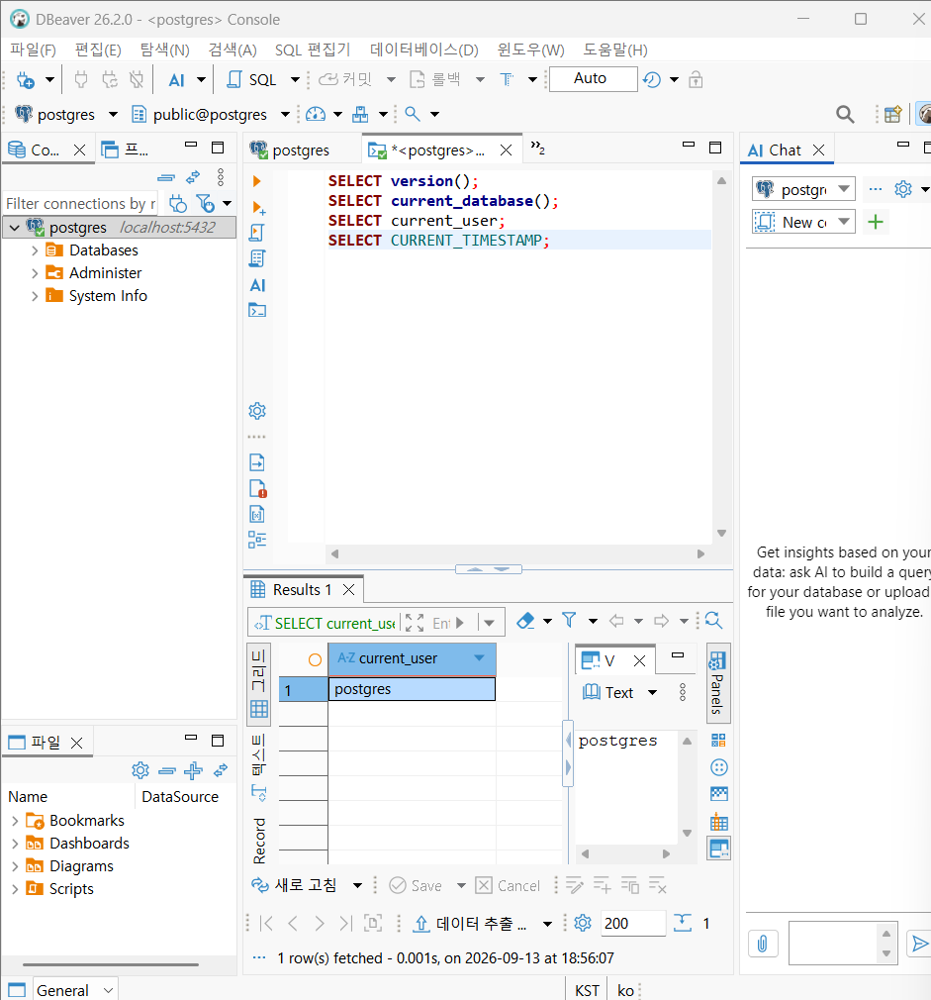
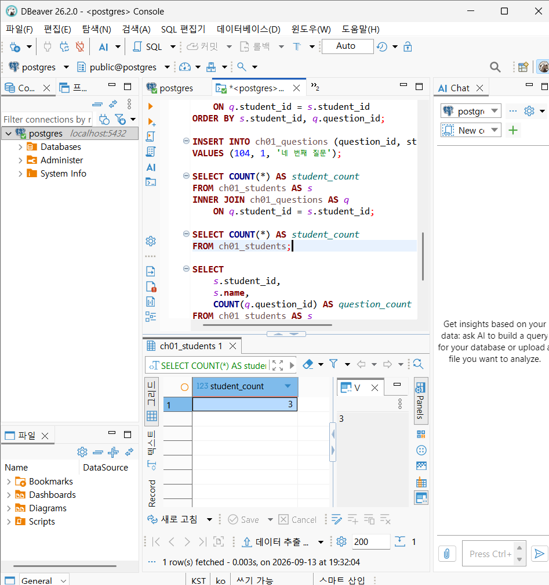
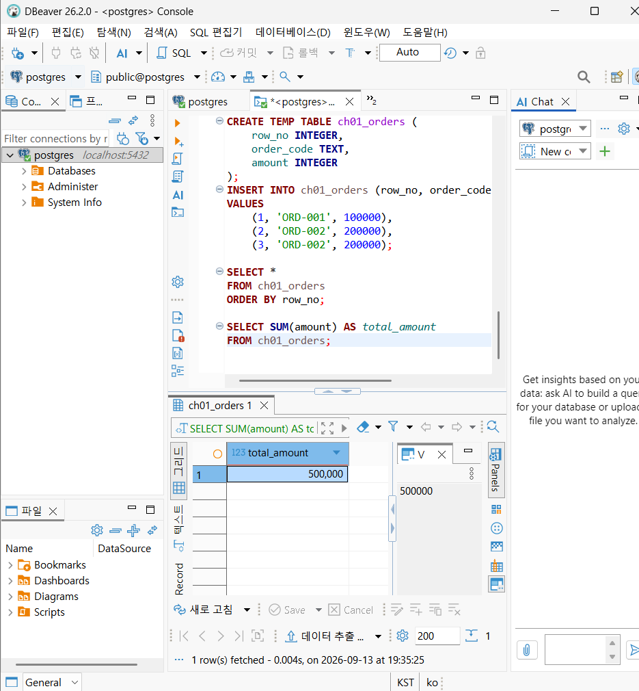
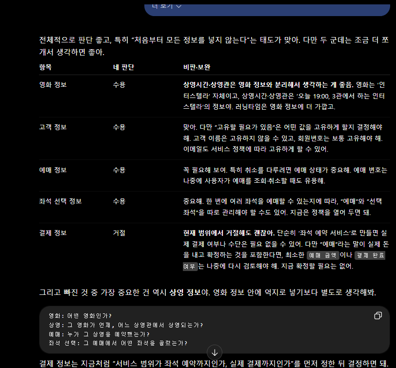

# Chapter 01 확장 실습 답안 템플릿

> **과제:** AI 시대에 데이터베이스를 왜 배워야 하는가  
> **사용 방법:** 이 파일을 내려받아 **본인의 GitHub 저장소**에 `chapter01_answer.md`라는 이름으로 저장한 뒤 답안을 작성합니다.  
> **제출 방법:** LMS에는 파일을 업로드하지 않고, **본인 GitHub 저장소의 `chapter01_answer.md` 파일 URL**을 제출합니다.

---

## 0. 학생 정보

| 항목 | 작성 내용 |
| --- | --- |
| 학번 | 2021-xxxxx |
| 이름 | 오유진 |
| GitHub 계정 | dhxxxxxxx@example.com |
| 과제 작성일 | 2026.09.13. |
| 사용한 AI 도구 | chatgpt, claude |

> 실제 비밀번호, API Key, 전체 DB 접속 URL, 개인정보는 이 파일이나 캡처 화면에 기록하지 않습니다.

---

# 1. PostgreSQL 실행 환경 확인

## 1-1. 실행한 SQL

```sql
SELECT version();
SELECT current_database();
SELECT current_user;
SELECT CURRENT_TIMESTAMP;
```

## 1-2. 실행 결과 기록

```text
PostgreSQL 버전: PostgreSQL 18.6 on x86_64-windows, compiled by msvc-19.44.35228, 64-bit
현재 데이터베이스: postgres
현재 사용자: postgres
현재 시각: 2026-09-13 18:55:50.220 +0900
```

## 1-3. 내가 확인한 내용

1. SQL을 작성하는 프로그램과 PostgreSQL은 같은 프로그램인가요?

```text
나의 답: 아니요.
```

2. `current_database()` 결과는 무엇을 의미하나요?

```text
나의 답: 현재 쓰고 있는 데이터베이스
```

3. SQL이 실행되었다는 사실만으로 데이터 내용도 올바르다고 할 수 있나요?

```text
나의 답: 아니요.
```

## 1-4. 증거 화면

아래 경로에 캡처 이미지를 저장하는 것을 권장합니다.

```text
assignments/chapter01/images/step01_environment.png
```

이미지를 저장했다면 아래 링크의 파일명을 실제 파일명에 맞게 수정합니다.

```markdown

```

**이미지 삽입 위치:



<!-- 아래 줄의 주석을 지우고 실제 이미지 Markdown을 넣어도 됩니다. -->

`여기에 STEP 1 증거 화면을 삽입하세요.`


---

# 2. Chapter 01 핵심 내용 복습

교재 문장을 그대로 복사하지 말고 자신의 말로 작성합니다.

| 본문의 핵심 | 나의 설명 |
| --- | --- |
| AI가 SQL을 만들어도 DB를 배워야 한다 | 인간이 DB를 배워야할 이유가 분명히 있다. |
| 데이터 구조가 중요하다 | 데이터의 구조를 볼 줄 알아야 한다. |
| SQL 결과를 검증해야 한다 | SQL에 맹목적으로 의존하면 안 된다. |
| 데이터 품질이 AI 답변 품질에 영향을 준다 | 데이터 자체가 AI 답변에 영향을 준다. |
| 저장 방식은 데이터 양만 보고 선택하지 않는다 | 데이터 양 외의 것을 고려하여 저장 방식을 선택한다. |

## 가장 중요하다고 생각한 한 문장

```text
AI가 SQL을 만들어도 DB를 배워야 한다.
```

---

# 3. 실행 성공과 결과 정확성의 차이

## 3-1. SQL 실행 전 예상

학생 A는 질문 2개, 학생 B는 질문 1개, 학생 C는 질문이 없습니다.

```text
전체 학생 수: ____3__ 명
전체 질문 수: ____3__ 개
질문이 있는 학생 수: ___2___ 명
질문이 없는 학생 수: ____1__ 명
```

## 3-2. 임시 테이블 생성 및 데이터 입력 완료 확인

- [O] `ch01_students` 생성
- [O] `ch01_questions` 생성
- [O] 학생 3명 입력
- [O] 질문 3건 입력
- [O] 두 테이블의 데이터를 직접 조회

## 3-3. 잘못된 학생 수 SQL 실행 결과

실행한 SQL:

```sql
SELECT COUNT(*) AS student_count
FROM ch01_students AS s
INNER JOIN ch01_questions AS q
    ON q.student_id = s.student_id;
```

실행 결과:

```text
3
```

## 3-4. JOIN 상세 결과 관찰

```text
학생 A가 나타난 행 수: 2
학생 B가 나타난 행 수: 1
학생 C가 나타난 행 수: 0
```

다음 질문에 답합니다.

### Q1. 학생 C가 왜 결과에서 사라졌나요?

```text
학생 C는 질문을 하지 않았기 때문이다.
```

### Q2. 학생 A가 왜 여러 행으로 나타났나요?

```text
학생 A는 질문을 여러 번 했기 때문이다.
```

### Q3. 위 `COUNT(*)`가 실제로 세고 있었던 것은 무엇인가요?

```text
질문이 있는 학생과 질문의 조합 갯수를 세고 있었다.
```

### Q4. 결과 숫자가 우연히 실제 학생 수와 같아도 바로 믿으면 안 되는 이유는 무엇인가요?

```text
질문 수가 늘어날 때 여러 행이 될 수 있고, 질문이 없을 때 결과에서 제외되는 경우가 있다. SQL이 어떻게 이루어졌는지 잘 살펴보아야 한다.
```

## 3-5. 질문 한 건을 추가한 뒤 다시 실행

추가한 데이터:

```text
INSERT INTO ch01_questions (question_id, student_id, question_text)
VALUES (104, 1, '네 번째 질문')
```

다시 실행한 결과:

```text
AI SQL 결과: 4
실제 학생 수: 3
```

### 결과 해석

```text
데이터가 바뀐 뒤 무엇이 달라졌는지: 질문을 하나 더 입력하자, SQL 결과도 1이 늘어나 4가 되었다. 

실제 학생 수는 왜 그대로인지: 질문이 늘어났을 뿐, 학생 수는 늘어나지 않았다.

이 실험을 통해 알게 된 점: 질문을 세는 SQL이었다.
```

## 3-6. 학생 테이블을 직접 센 결과

```sql
SELECT COUNT(*) AS student_count
FROM ch01_students;
```

결과:

```text
3
```

### 두 SQL의 차이를 내 말로 설명

```text
첫 번째 SQL은 ___질문 수___________________________________________을 세고 있었다.

두 번째 SQL은 ____학생 수____________________________________________을 세고 있었다.

따라서 SQL을 검토할 때는 문법보다 먼저
__확인하고자 하는 바를 묻고 있는 내용인지_____________________________________을 확인해야 한다.
```

## 3-7. 증거 화면

권장 경로:

```text
assignments/chapter01/images/step03_join_result.png
```

`여기에 STEP 3 핵심 증거 화면을 삽입하세요.`

---

# 4. 잘못된 데이터가 결과를 바꾸는 과정

## 4-1. 주문 데이터 확인

다음 데이터를 입력한 뒤 실제 결과를 확인합니다.

```text
ORD-001, 100000
ORD-002, 200000
ORD-002, 200000
```

## 4-2. 실행 전 예상

업무적으로 주문이 `ORD-001`, `ORD-002` 두 건이고 `order_code`가 주문을 고유하게 구분한다고 **가정할 경우** 예상 합계:

```text
____300000______ 원
```

> 위 가정 자체가 실제 업무 규칙인지 확인해야 한다는 점도 기억합니다.

## 4-3. SQL 합계

```sql
SELECT SUM(amount) AS total_amount
FROM ch01_orders;
```

실제 결과:

```text
___500000_______ 원
```

## 4-4. 결과 해석

### `SUM` 문법 자체가 잘못된 것인가요?

```text
아니요
```

### 결과 차이의 원인은 무엇인가요?

```text
실제 저장된 데이터를 똑같더라도 정직하게 더하느냐, 잘못 중복으로 입력된 것으로 보느냐의 차이.
```

### SQL이 정확하게 실행되어도 업무 숫자가 잘못될 수 있는 이유를 설명하세요.

```text
입력을 중복으로 했을 때 업무 상으로는 안 더하겠지만 SQL은 그렇지 않다.
```

## 4-5. AI에게 같은 데이터를 분석시킨 결과

AI가 계산한 합계:

```text
500,000원
```

AI가 중복 가능성을 언급했나요?

```text
네
```

AI가 `ORD-002` 두 행이 실제 두 주문인지 중복 입력인지 스스로 확정할 수 있나요? 이유도 적으세요.

```text
확정할 수 없다. 실제 업무규칙을 확인하는 것은 인간이 해야할 일이다. 업무에서 어떻게 처리하는지 다를 수 있다.
```

추가로 확인해야 할 업무 규칙:

```text
1. 주문데이터 번호가 주문 하나 당 하나가 부여되는 것인지
2.
3.
```

내가 최종적으로 내린 판단:

```text
300,000
```

## 4-6. 증거 화면

권장 경로:

```text
assignments/chapter01/images/step04_duplicate_result.png
```

`여기에 STEP 4 핵심 증거 화면을 삽입하세요.`

---

# 5. 파일·스프레드시트·DBMS 선택 연습

각 사례에 대해 **AI에게 묻기 전에 먼저 본인의 판단을 작성**합니다.

## 사례 A. 개인 독서 기록

```text
나의 선택: 파일
선택 이유: 사용자가 한 명뿐이고 기록 구조가 단순해, 도구를 갖출수록 오히려 번거로워지는 규모입니다.
어떤 조건이 추가되면 다른 방식으로 바꿀 것인지: 평점이나 장르를 넣어 통계를 뽑고 싶어지면 스프레드시트로, 이 기록을 서비스 형태로 공개하게 되면 DBMS로 넘어갑니다.

```

## 사례 B. 동아리 행사 신청 명단

```text
나의 선택: 스프레드시트
선택 이유: 여러 명이 같은 표를 함께 만지는 상황과 참석률 계산을 한 번에 감당하면서도, 짧게 쓰고 접는 용도에 부담이 없습니다.
어떤 조건이 추가되면 다른 방식으로 바꿀 것인지: 행사가 계속 반복되며 데이터가 누적되거나, 신청을 온라인 폼으로 직접 받거나, 연락처 열람을 사람마다 제한해야 하면 DBMS가 필요합니다.
```

## 사례 C. 온라인 강의 서비스

```text
나의 선택: DBMS
선택 이유: 학생과 강의가 서로 여러 건으로 얽히는 데다, 동시 신청 처리와 상태 추적, 결제 금액 고정처럼 어긋나면 안 되는 조건들이 함께 요구됩니다.
어떤 조건이 추가되면 다른 방식으로 바꿀 것인지: 규모가 아주 작고 결제가 없는 일회성 운영이라면 스프레드시트로 출발해도 무리가 없습니다.
```

## 판단 기준 체크

- [ O ] 데이터 증가
- [ O ] 여러 사용자의 동시 수정
- [ O ] 데이터 사이의 관계
- [ O ] 반복 조회와 집계
- [ O ] 정확성·일관성
- [ O ] 변경 이력
- [ O ] 권한 구분
- [ O ] 백업·복구
- [ O ] 웹·앱에서 지속 사용

### 데이터가 적으면 무조건 스프레드시트를 사용해야 하나요?

```text
나의 답: 아니요.
```

---

# 6. 나만의 서비스 데이터 구조 초안

> 이 내용은 이후 Chapter에서 계속 확장할 수 있으므로 신중하게 작성합니다.

## 6-1. 서비스 정의

```text
서비스 이름: 영화 예매

이 서비스는
______________________영화 예매________________________________________
하기 위한 서비스이다.
```

## 6-2. 관리할 데이터 후보

```text
1. 영화 이름
2. 영화 시간대
3. 좌석 가격
4. 좌석 정보
5. 고객 이름
```

## 6-3. 한 행의 의미

| 데이터 후보 | 한 행의 의미 |
| --- | --- |
| 고객 데이터 한 행  | 고객 한 명 |
| 영화 데이터 한 행 | 영화 한 편 |
| 영화 예매 데이터 한 행 | 고객이 영화를 예매한 사건 한 건 |

## 6-4. 관계를 자연어로 설명

```text
1. 한 고객은 여러 영화를 예매할 수 있다.
2. 한 영화에는 여러 고객이 신청할 수 있다.
3. 한 예매는 한 고객과 한 영화를 연결한다.
```

## 6-5. 아직 결정하지 않은 정책

```text
Q1. 취소 주문도 포함되는가?
Q2. 한번에 여러 예매를 포함하는가?
Q3. 회원 이메일은 고유해야 하는가?
```

> 확정되지 않은 정책을 AI가 임의로 결정한 경우 그대로 받아들이지 않습니다.

---

# 7. AI를 검토자로 활용하기

## 7-1. 내가 AI에게 전달한 핵심 프롬프트

개인정보나 비밀번호 등 민감한 내용은 제거한 뒤 기록합니다.

```text
나는 데이터베이스를 처음 배우는 학생입니다.
아직 ERD나 정규화를 배우기 전입니다.
내가 생각한 서비스는 다음과 같습니다.
서비스: 영화 예매
목적: 영화예매하기 위한 서비스이다.
관리할 데이터 후보:
1. 영화 이름

2. 영화 시간대

3. 좌석 가격

4. 좌석 정보

5. 고객 이름
내가 생각한 관계:

1. 한 고객은 여러 영화를 예매할 수 있다.

2. 한 영화에는 여러 고객이 신청할 수 있다.

3. 한 예매는 한 고객과 한 영화를 연결한다.

아직 결정하지 못한 정책:

Q1. 취소 주문도 포함되는가?

Q2. 한번에 여러 예매를 포함하는가?

Q3. 회원 이메일은 고유해야 하는가?

지금 단계에서는 완성된 SQL을 만들지 말고,

1. 내가 놓친 데이터가 있는지,

2. 서로 다른 의미의 데이터를 한 항목으로 섞은 것은 없는지,

3. 추가로 확인해야 할 업무 질문은 무엇인지,

4. 파일·스프레드시트·관계형 DBMS 중 무엇이 적합해 보이는지

초보자가 이해할 수 있게 검토해 주세요.

확정되지 않은 정책은 임의로 정답처럼 결정하지 마세요.
```

## 7-2. AI의 주요 제안과 나의 판단

최소 5개를 작성합니다.

| AI의 제안 | 수용 / 수정 / 거절 | 나의 판단 근거 |

| 영화 정보: 영화 이름 외에도 상영시간, 상영관, 러닝타임 등이 필요할 수 있음 | 수용 | 필요한 데이터 중 일부

고객 정보: 고객 이름만으로는 같은 이름을 구분하기 어려움. 이메일, 전화번호, 회원번호 등을 고려할 수 있음 | 수용 | 고유할 필요가 있음

예매 정보: 예매 번호, 예매 일시, 예매 상태(예매 완료/취소 등) | 수용 | 고려필요

좌석 선택 정보: 고객이 어느 좌석을 선택했는지  | 수용 | 고려필요 

결제 정보: 실제 결제 금액, 결제 여부, 결제 수단 등이 필요한지 | 거절 |불필요

## 7-3. AI에게 자기 답변을 다시 비판하도록 요청한 결과

첫 번째 답변과 달라진 점:

```text
상영 정보는 실제 영화관처럼 여러 시간대·상영관을 관리할 경우 필요할 가능성이 높다.
영화별 시간대가 하나뿐이라면 별도 관리가 꼭 필요하다고 단정할 수는 없다.
예매 번호도 사용자가 예매를 조회·취소하거나 고객센터가 예매를 찾는 기능이 있을 때 필요하다.


AI가 처음에 임의로 가정했던 내용:

```text
요구사항에 없는데 임의로 가정한 내용은 다음과 같아.

실제 결제가 이루어진다.
상영관이 여러 개다.
영화마다 여러 상영 시간대가 있다.
한 번에 여러 좌석을 예매할 수 있다.
회원제로 운영하며 이메일·전화번호·회원번호를 받는다.
취소 기능과 고객센터 조회 기능이 있다.
```

추가로 업무 담당자에게 확인해야 한다고 판단한 내용:

```text
이 서비스는 좌석 예약만 하나요, 결제까지 포함하나요?
고객은 회원만 가능한가요, 비회원도 가능한가요?
영화마다 상영 시간이 여러 개인가요?
상영관을 여러 개 관리하나요?
한 예매로 여러 좌석을 선택할 수 있나요?
예매 취소를 허용하나요? 취소된 기록은 남기나요?
좌석 가격은 모든 좌석·시간대에 동일한가요?
고객을 구분하기 위해 어떤 정보를 받을 건가요?
```

## 7-4. AI 활용에 대한 나의 평가

```text
가장 유용했던 부분:
영화 정보에 상영시간을 넣으면, 같은 영화가 여러 번 상영될 때 영화 이름·러닝타임 등이 반복될 수 있어.
고객 이름만 저장하면 동명이인을 구분하지 못해.
좌석 정보만 있고 “어느 상영의 어느 좌석인지”가 없으면, 같은 A1 좌석을 여러 시간대에서 어떻게 구분할지 애매해져.
예매 상태가 없으면 취소된 예매를 삭제할지, 남길지 알 수 없어. 삭제한다면 취소 이력 자체가 사라질 수 있어.
결제 정보를 제외한다면, “예매 완료”가 단순 예약인지 실제 결제 완료인지 용어가 혼동될 수 있어.

이런 피드백은 굉장히 날카로웠다.


수정하거나 거절한 부분:
고객 이름 뒤에 고유번호를 넣어서 저장하면 동명이인을 구별할 수 있을 것 같다.


그렇게 판단한 근거:
너무 많은 정보를 저장해야 하면 개인정보 문제가 있기 때문이다.

AI가 없었다면 놓쳤을 가능성이 있는 질문:
상영시간도 고려를 했어야 할 것 같다는 것
```

## 7-5. AI 활용 증거 화면

권장 경로:

```text
assignments/chapter01/images/step07_ai_review.png
```

AI 대화 전체를 캡처할 필요는 없습니다. 핵심 요청과 검토 과정이 보이는 화면 1장 정도면 충분합니다.

`여기에 AI 활용 증거 화면을 삽입하세요.`

---

# 8. 기준 데이터·파생 데이터·AI 생성 결과 구분

내 서비스에 맞게 작성합니다.

| 구분 | 내 서비스의 예 | 판단 이유 |
| --- | --- | --- |
| 기준 데이터 | 영화예매정보 | 원본 후보  |
| 파생 데이터 | 영화 월별 예매 순위 | 집계해서 만들 수 있는 데이터 |
| AI 생성 결과 | 이번달 인기 영화 분석 | 집계를 바탕으로 데이터에 따라 만들어진 AI 겨로가 |

### 기준 데이터가 변경되면 파생 데이터는 어떻게 해야 하나요?

```text
그에 따라 다르게 변경되어야 한다
```

### AI 결과만 있고 원본 데이터가 없다면 결과를 충분히 검증할 수 있나요?

```text
없다
```

---

# 9. 최종 성찰

아래 세 문장은 반드시 **본인의 말**로 작성합니다.

```text
1. SQL이 실행되어도 결과를 바로 믿으면 안 되는 이유는
   ________SQL의 실행과 올바른 내용인지는 별개이기 때문____________________________________________________ 이다.

2. AI를 데이터베이스 학습에 활용할 때 가장 중요한 것은
   ____데이터의 품질과 프롬포트의 비판적 검토________________________________________________________ 이다.

3. 이번 실습 이후 내가 더 확인하고 싶은 것은
   __________데이터 구조에 따라 어떻게 검증해야 하는지 SQL의 검토 능력 향상__________________________________________________ 이다.
```

## 이번 Chapter에서 새롭게 알게 된 점 3가지

```text
1. SQL이 무엇인지
2. SQL의 올바른 실행과 올바른 질문이 무엇인지 구별하는 것
3. AI의 SQL도 틀릴 수 있다는 것
```

## 아직 이해가 명확하지 않은 부분

```text
1. 데이터의 구조
2. SQL 문법
```

---

# 10. 제출 전 자기 점검

- [O] PostgreSQL 실행 화면을 확인했다.
- [O ] SQL 실행 전에 예상 결과를 먼저 작성했다.
- [O ] `INNER JOIN` 예제에서 누락과 반복을 설명할 수 있다.
- [ O] 숫자가 우연히 같아도 의미가 다를 수 있음을 설명했다.
- [ O] 중복 데이터가 집계 결과에 미치는 영향을 확인했다.
- [O ] 저장 방식을 데이터 양만으로 판단하지 않았다.
- [O ] 개인 서비스 주제를 하나 정했다.
- [O ] 데이터 후보와 한 행의 의미를 작성했다.
- [O ] 미확정 정책을 최소 3개 작성했다.
- [O ] AI 제안을 수용·수정·거절로 구분했다.
- [ O] AI 제안에 대한 판단 근거를 작성했다.
- [O ] 기준 데이터·파생 데이터·AI 결과를 구분했다.
- [O ] 핵심 증거 이미지가 Markdown에서 정상적으로 보인다.
- [O ] 비밀번호·API Key·개인정보가 노출되지 않았다.

---

# 11. LMS 제출 정보

## 내 GitHub 답안 파일 URL

아래에는 **교수자 템플릿 URL이 아니라 본인이 작성한 답안 파일의 GitHub URL**을 기록합니다.

```text
https://github.com/<본인-GitHub-ID>/<본인-저장소>/blob/main/assignments/chapter01/chapter01_answer.md
```

내 실제 제출 URL:

```text
https://github.com/dhdbwls777/database-course-2026-2/blob/main/chapter01_answer.md
```

> LMS에는 위 **본인 저장소의 `chapter01_answer.md` 파일 URL 하나**를 제출합니다.

---

## 권장 학생 저장소 구조

```text
<본인-저장소>/
└── assignments/
    └── chapter01/
        ├── chapter01_answer.md
        └── images/
            ├── step01_environment.png
            ├── step03_join_result.png
            ├── step04_duplicate_result.png
            └── step07_ai_review.png
```

이 구조를 사용하면 이후 Chapter 02, Chapter 03도 같은 방식으로 계속 추가할 수 있습니다.
