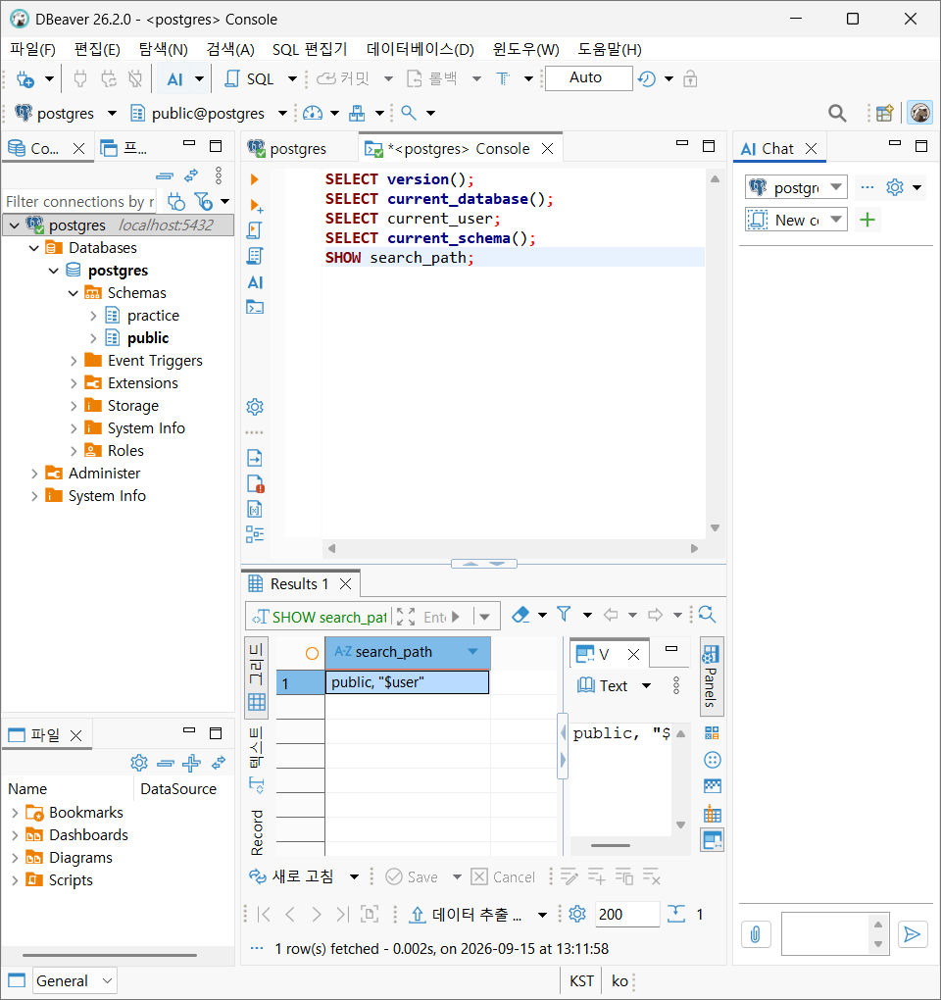
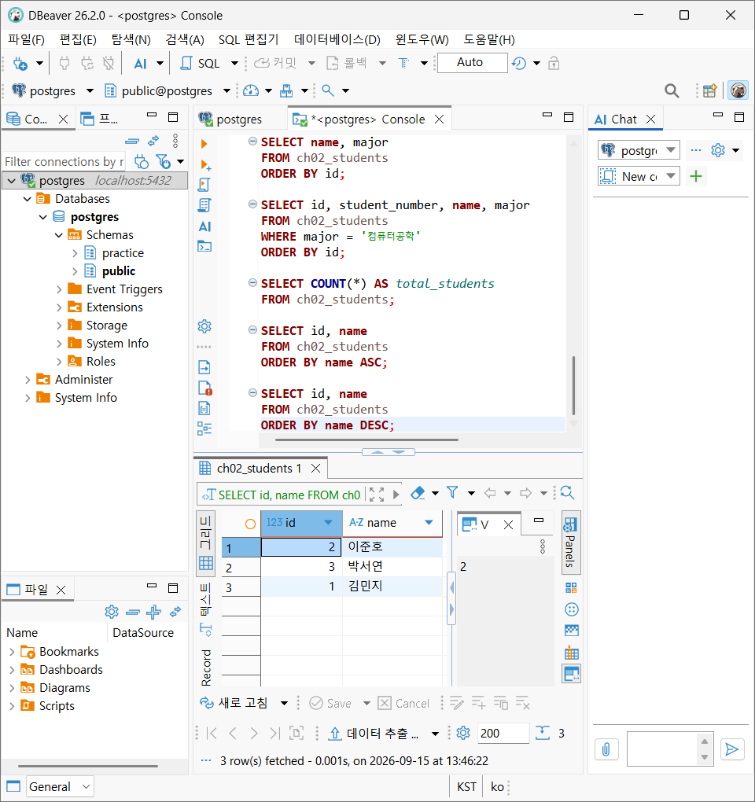
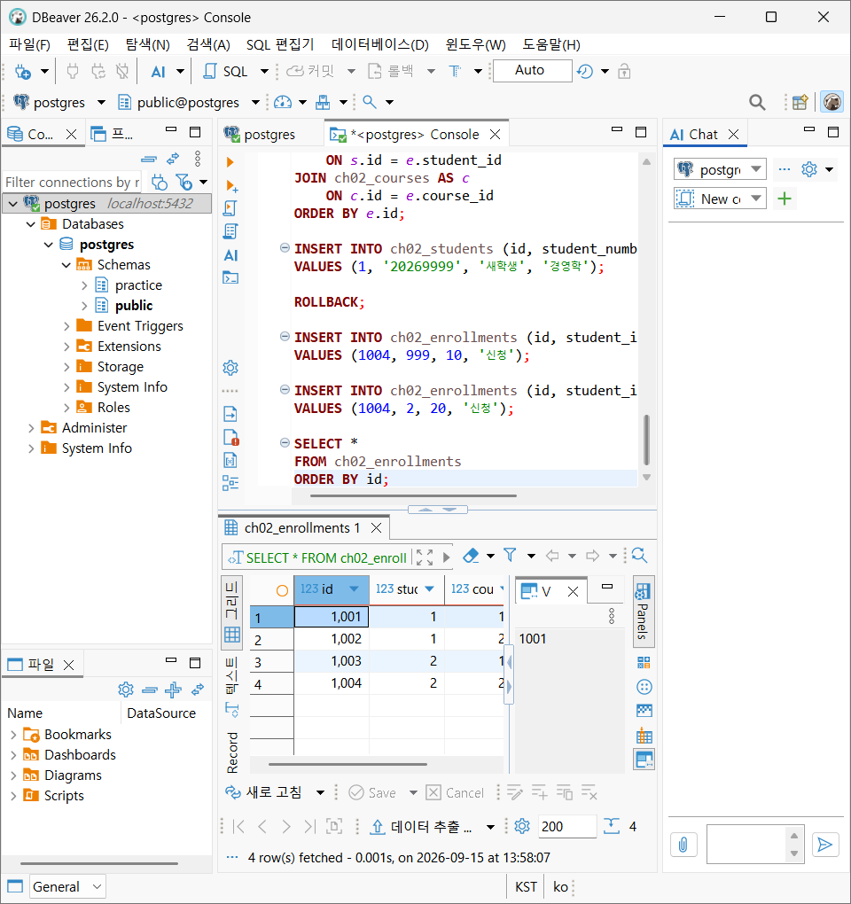
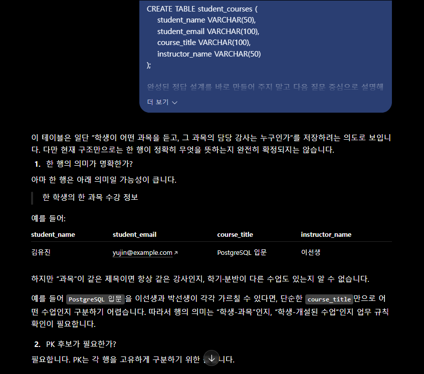

# Chapter 02 확장 실습 답안 템플릿

> **과제:** 데이터와 DBMS의 기본 개념  
> **사용 방법:** 이 파일을 내려받아 본인의 GitHub 저장소에 `chapter02_answer.md`라는 이름으로 저장한 뒤 실습하면서 바로 작성합니다.  
> **제출 방법:** LMS에는 파일을 직접 업로드하지 않고, **본인 GitHub 저장소의 `chapter02_answer.md` 파일 URL**을 제출합니다.

---

## 제출 전 개인정보 주의

LMS에서 제출자를 확인할 수 있으므로 이 공개 Markdown 파일에 학번이나 실명을 반드시 적을 필요는 없습니다.

```text
GitHub 계정 또는 별칭: 유진
과제 작성일: 2026.09.15.
사용한 AI 도구: chatgpt
```

> 실제 비밀번호, API Key, 전체 DB 접속 URL, 개인정보가 포함된 화면은 올리지 않습니다.

---

# 1. PostgreSQL에서 현재 위치 확인

## 1-1. 실행한 SQL

```sql
SELECT version();
SELECT current_database();
SELECT current_user;
SELECT current_schema();
SHOW search_path;
```

## 1-2. 실행 결과 기록

```text
PostgreSQL 버전: PostgreSQL 18.6 on x86_64-windows, compiled by msvc-19.44.35228, 64-bit
현재 데이터베이스: postgres
현재 사용자: postgres
현재 스키마: public
search_path: public, "$user"
```

## 1-3. 구조를 내 말로 설명

```text
PostgreSQL은:  관계형 데이터베이스를 관리하는 DBMS입니다.

현재 접속한 데이터베이스는:
PostgreSQL 서버 안에서 지금 작업 중인 하나의 데이터베이스입니다.

스키마는:
데이터베이스 안에서 테이블·뷰 등을 구분해 정리하는 논리적 공간(폴더 비슷한 개념)입니다.

DBeaver 또는 psql 같은 도구는: PostgreSQL에 접속해서 SQL을 실행하고 결과를 확인하는 클라이언트 도구입니다.
```

## 1-4. 계층 구조 완성

```text
사용자
→ _DBeaver 또는 psql 같은 클라이언트 도구
→ PostgreSQL DBMS
→ 현재 접속한 데이터베이스
→ 스키마
→ 테이블
→ 행 / 열
```

## 1-5. 증거 화면

권장 경로:

```text
assignments/chapter02/images/step01_environment.png
```

```markdown

```

`여기에 STEP 1 핵심 증거 화면을 삽입하세요.`

---

# 2. 데이터베이스 안의 스키마와 테이블 관찰

## 2-1. 스키마 조회 결과

실행한 SQL:

```sql
SELECT schema_name
FROM information_schema.schemata
ORDER BY schema_name;
```

관찰한 스키마 이름 중 3개 이내를 적습니다.

```text
1. information_schema
2. pg_catalog
3. pg_temp_6
```

### `public`은 무엇인가요?

```text
나의 설명: PostgreSQL이 기본으로 만들어 주는 스키마 이름
```

### 데이터베이스와 스키마는 같은 것인가요?

```text
나의 설명: 아니다. 데이터베이스 안에서 목적별로 테이블 등을 정리하는 하위 공간이 스키마이다.
```

## 2-2. 현재 보이는 테이블 조회

```sql
SELECT table_schema, table_name
FROM information_schema.tables
WHERE table_type = 'BASE TABLE'
  AND table_schema NOT IN ('pg_catalog', 'information_schema')
ORDER BY table_schema, table_name;
```

```text
조회된 사용자 테이블 수 또는 눈에 띈 테이블:
members 테이블이 조회되었다.

아직 테이블이 거의 없어도 괜찮은 이유:
현재는 PostgreSQL 접속, 데이터베이스와 스키마 구조, 테이블 조회 방법을 확인하는 단계이므로 테이블 수가 많을 필요는 없다.

```

## 2-3. 관찰 정리

```text
PostgreSQL 서버 안에는 여러 ______데이터베이스________가 있을 수 있다.
한 데이터베이스 안에는 여러 ______스키마_______가 있을 수 있다.
스키마 안에는 테이블과 같은 ___데이터베이스 객체____________가 존재한다.
```

---

# 3. TEMP TABLE로 테이블·행·열·키 직접 확인

## 3-1. 임시 테이블 생성 완료 확인

- [O] `ch02_students` 생성
- [O] `ch02_courses` 생성
- [O] `ch02_enrollments` 생성

각 테이블의 **한 행 의미**를 적습니다.

| 테이블 | 한 행의 의미 |
| --- | --- |
| `ch02_students` | 학생 한 명 |
| `ch02_courses` |  강의 한 개 |
| `ch02_enrollments` | 특정 학생이 특정 강의를 신청한 사건 한 건|

## 3-2. 열의 의미 확인

### `ch02_students`

| 열 | 값의 의미 | 내부 식별자 / 업무 식별자 / 일반 속성 |
| --- | --- | --- |
| `id` | DB 내부에서 학생 행을 구분하는 내부 식별자 후보 | 내부 식별자 |
| `student_number` | 학교 업무에서 사용하는 업무 식별자 후보| 업무 식별자 |
| `name` | 학생 이름 | 일반 속성 |
| `major` |   전공 | 일반 속성 |

### `ch02_enrollments`

| 열 | 값의 의미 | PK / FK / 일반 속성 |
| --- | --- | --- |
| `id` | 수강신청 행을 구분하는 식별자 | PK |
| `student_id` |  ch02_students.id를 참조 | FK |
| `course_id` | ch02_courses.id를 참조 | FK |
| `status` | 수강 상태 | 일반 속성 |

## 3-3. 입력된 행 수

```text
students 행 수: 3
courses 행 수: 2
enrollments 행 수: 3
```

## 3-4. 내부 식별자와 업무 식별자

```text
students.id가 필요한 이유: DB 내부에서 각 학생 행을 안정적으로 구분하고, 다른 테이블에서 학생을 참조하기 위해 필요하다.

student_number가 필요한 이유:
학교 업무에서 학생을 식별하고 조회할 때 사용하는 학번이다.

둘을 항상 같은 값으로 사용하지 않아도 되는 이유: id는 DB 관리 목적의 내부 식별자이고 student_number는 업무 규칙에 따라 바뀌거나 형식이 달라질 수 있는 업무 식별자이기 때문이다.
```

## 3-5. 숫자처럼 보이는 학번을 문자열로 저장한 이유

```text
나의 설명: 학번은 계산하는 숫자가 아니라 학생을 구분하는 코드이기 때문이다. 앞자리에 0이 올 수 있으며(예: '00123456'), 숫자형으로 저장하면 앞의 0이 사라진다. 또한 향후 문자나 하이픈 등 숫자 이외의 형식이 포함될 가능성도 있다.
```

---

# 4. 테이블과 조회 결과는 다르다

## 4-1. 원본 테이블 행 수

```text
ch02_students 전체 행 수: 3
```

## 4-2. 일부 열만 조회

실행 SQL:

```sql
SELECT name, major
FROM ch02_students
ORDER BY id;
```

```text
원본 테이블의 열 수와 조회 결과의 열 수가 다른 이유: 원본 테이블에는 id, student_number, name, major의 4개 열이 있지만, SELECT로 name과 major만 선택했기 때문이다.
```

## 4-3. 조건을 적용한 조회

실행 SQL:

```sql
SELECT id, student_number, name, major
FROM ch02_students
WHERE major = '컴퓨터공학'
ORDER BY id;
```

```text
원본 테이블 행 수: 3
조회 결과 행 수: 2
원본 테이블의 데이터가 삭제된 것인가?: 아니오
그렇게 판단한 이유: SELECT문은 데이터를 조회할 뿐 원본 테이블을 변경하거나 삭제하지 않는다. WHERE 조건에 맞는 전공이 ‘컴퓨터공학’인 학생 2명만 결과로 표시된 것이다.
```

## 4-4. 정렬 결과 비교

```sql
SELECT id, name
FROM ch02_students
ORDER BY name ASC;

SELECT id, name
FROM ch02_students
ORDER BY name DESC;
```

```text
ASC 결과의 첫 학생: 김민지
DESC 결과의 첫 학생: 이준호

이 실험을 통해 ORDER BY에 대해 알게 된 점: ORDER BY는 조회 결과의 정렬 순서를 지정한다. ASC는 오름차순, DESC는 내림차순이며,원본 테이블에 저장된 행 자체의 순서를 바꾸지는 않는다.
```

## 4-5. 증거 화면

권장 경로:

```text
assignments/chapter02/images/step04_result_set.png
```

`여기에 STEP 4 핵심 증거 화면을 삽입하세요.`

---

# 5. PK와 FK를 실제로 관찰

## 5-1. 정상 데이터의 관계 읽기

다음 SQL 결과를 보고 작성합니다.

```sql
SELECT
    e.id AS enrollment_id,
    s.name AS student_name,
    c.title AS course_title,
    e.status
FROM ch02_enrollments AS e
JOIN ch02_students AS s
    ON s.id = e.student_id
JOIN ch02_courses AS c
    ON c.id = e.course_id
ORDER BY e.id;
```

```text
한 행이 의미하는 것: 한 학생이 하나의 과목을 수강신청한 한 건의 기록. 해당 학생, 과목, 수강 상태가 함께 나타남.

같은 student_id가 여러 enrollment 행에서 반복될 수 있는 이유: 학생 1명이 여러 수강신청을 가질 수 있기 때문

같은 course_id가 여러 enrollment 행에서 반복될 수 있는 이유: 한 과목을 여러 학생이 신청하거나 수강할 수 있기 때문
```

## 5-2. 기본키 중복 오류 관찰

중복 PK 입력을 시도한 결과: 

```text
실행 성공 / 실패: 실패
오류 메시지에서 확인한 핵심 단어: 중복된 키 값, 고유 제약 조건을 위반함
왜 실패했다고 생각하는가: id는 기본키(PK)이므로 각 학생 행마다 값이 하나씩만 존재해야 한다.
이미 id가 1인 학생이 있으므로, 같은 id 값으로 새 행을 추가할 수 없다.
```

## 5-3. 존재하지 않는 학생을 참조하는 FK 오류 관찰

존재하지 않는 `student_id`를 사용한 수강신청 입력 결과:

```text
실행 성공 / 실패: 실패
오류 메시지에서 확인한 핵심 단어: 참조키(foreign key) 제약 조건을 위배
왜 실패했다고 생각하는가: student_id는 ch02_students 테이블에 실제로 존재하는 학생의 id만 참조해야 한다. 하지만 id가 999인 학생이 없으므로, 참조 무결성 규칙을 위반하여 입력이 실패했다.
```

## 5-4. PK와 FK의 차이 정리

```text
PK는 테이블의 각 행을 고유하게 식별하기 위한 키이다.

FK는 다른 테이블의 행을 참조하여 테이블 간 관계를 연결하기 위한 키이다.

FK 값이 여러 행에서 반복될 수 있는 이유는
여러 행이 같은 하나의 행을 참조할 수 있기 때문이다.
```

## 5-5. 증거 화면

권장 경로:

```text
assignments/chapter02/images/step05_pk_fk.png
```

> 오류 메시지는 전체 화면이 아니라 테이블명·constraint·참조 오류가 보이는 정도만 캡처합니다.

`여기에 STEP 5 핵심 증거 화면을 삽입하세요.`

---

# 6. 관계와 카디널리티를 자연어로 설명

현재 임시 데이터 기준으로 작성합니다.

```text
학생 한 명은 여러 수강신청을 가질 수 있는가?: 네

강의 한 개는 여러 수강신청을 가질 수 있는가?: 네

수강신청 한 건은 학생 몇 명을 참조하는가?: 1

수강신청 한 건은 강의 몇 개를 참조하는가?: 1
```

아래 구조를 완성합니다.

```text
students 1 ── __N enrollments _N ── 1 courses
```

### 학생과 강의가 N:M 관계라고 볼 수 있는 이유

```text
나의 설명: 한 학생은 여러 강의를 수강 신청할 수 있고, 한 강의도 여러 학생의 수강신청을 받을 수 있기 때문이다.
```

> 아직 0개 허용 여부, 필수 관계, 삭제 정책까지 확정하지 않습니다. 그런 규칙은 Chapter 05~06에서 다룹니다.

---

# 7. AI가 만든 테이블 구조 직접 검토

## 7-1. AI에게 묻기 전에 내가 먼저 찾은 문제

다음 구조를 보고 최소 4개를 적습니다.

```sql
CREATE TABLE student_courses (
    student_name VARCHAR(50),
    student_email VARCHAR(100),
    course_title VARCHAR(100),
    instructor_name VARCHAR(50)
);
```

```text
문제 1. 학생이 여러 강의를 수강하면 student_name과 student_email이 수강신청 건마다 반복 저장된다.
문제 2. 같은 강의를 여러 학생이 수강하면 course_title과 instructor_name이 반복 저장된다.
문제 3. 학생 이메일이나 강사 이름이 바뀌면 관련된 모든 행을 수정해야 하므로, 일부만 수정되면 데이터가 서로 달라질 수 있다.
문제 4. 학생, 강의, 수강신청을 각각 고유하게 구분할 id나 기본키(PK)가 없다. 따라서 같은 수강신청이 중복 입력되는 것을 막기 어렵다.
```

## 7-2. AI 검토 요청 프롬프트

사용한 핵심 프롬프트를 기록합니다.

```text
나는 PostgreSQL과 데이터베이스를 처음 배우는 학생입니다.
아직 정규화와 ERD를 정식으로 배우기 전입니다.
다음 테이블 구조를 검토해 주세요.
CREATE TABLE student_courses (
    student_name VARCHAR(50),
    student_email VARCHAR(100),
    course_title VARCHAR(100),
    instructor_name VARCHAR(50)
);

완성된 정답 설계를 바로 만들어 주지 말고 다음 질문 중심으로 설명해 주세요.
1. 한 행의 의미가 명확한가?
2. PK 후보가 필요한가?
3. 내부 식별자와 업무 식별자를 구분할 필요가 있는가?
4. FK로 표현해야 할 관계 후보는 무엇인가?
5. 중복 저장 위험이 있는가?
6. 현재 요구사항만으로 결정할 수 없는 정책은 무엇인가?
확정되지 않은 업무 규칙은 임의로 결정하지 마세요.

```

## 7-3. AI 제안과 나의 판단

| AI의 지적 또는 제안 | 동의 / 수정 / 보류 | 나의 근거 |
| --- | --- | --- |
| 한 행이 “한 학생의 한 강의 수강 관계”를 뜻하는지 명확히 해야 한다. | 동의 | 현재는 수강 상태, 신청일 등의 정보가 없어 행의 의미가 충분히 구체적이지 않다. |
| 각 행을 구분할 PK 후보가 필요하다. | 동의 | 같은 학생이 같은 강의를 여러 번 입력했는지, 서로 다른 수강신청인지 구분하기 어렵다. |
| 학생 이메일은 업무 식별자 후보가 될 수 있으나, 내부 id와 구분해 생각할 필요가 있다. | 동의 | 이메일은 변경될 수 있고, 내부 참조에는 별도 ID가 더 안정적일 수 있다. |
| 학생과 강의는 분리하고, 수강신청 테이블에서 FK로 연결하는 관계를 고려할 수 있다. | 동의 | 학생 정보와 강의 정보가 수강신청마다 반복 저장되는 문제를 줄일 수 있다. |
| 이메일의 중복 허용 여부, 동일 학생의 동일 강의 재수강 가능 여부는 정책 확인이 필요하다. | 보류 | 학교 운영 규칙에 대한 고려가 필욯다ㅏ. |

## 7-4. 본문과 대조한 항목

AI 설명 중 최소 하나를 `chapter02.md`와 비교합니다.

```text
AI가 설명한 내용:
학생 정보와 강의 정보를 수강신청 행마다 함께 저장하면
같은 정보가 반복되고, 변경 시 여러 행을 수정해야 할 수 있다.

본문에서 확인한 내용: 테이블은 행과 열로 데이터를 저장하며, 기본키와 외래 키를 통해 각 행을 구분하고 테이블 간 관계를 표현한다.


일치 / 부분 일치 / 수정 필요: 부분 일치

내가 최종적으로 이해한 내용: 반복 저장 자체가 항상 오류는 아니지만, 학생·강의처럼 독립적으로 관리할 정보가 여러 수강신청 행에서 반복되면 데이터 불일치와 수정 누락 위험이 생긴다.따라서 PK와 FK를 이용해 데이터의 식별과 관계를 분명히 관리할 필요가 있다.
```

## 7-5. 증거 화면

권장 경로:

```text
assignments/chapter02/images/step07_ai_review.png
```

`여기에 AI 검토 과정의 핵심 화면을 삽입하세요.`

---

# 8. Chapter 01의 개인 서비스 아이디어를 DB 용어로 다시 표현

Chapter 01에서 정한 개인 서비스 주제를 그대로 사용하거나 새 주제를 정해도 됩니다.

## 8-1. 서비스 기본 정보

```text
서비스 이름: 영화 예매 관리 서비스
서비스 목적: 상영 중인 영화를 선택하여 좌석을 예매하는 정보를 관리한다.
```

## 8-2. PostgreSQL 구조 후보

```text
데이터베이스 이름 후보: ai_database_study
스키마 이름 후보: movie_booking
```

> 아직 실제 데이터베이스나 스키마를 생성하지 않아도 됩니다.

## 8-3. 테이블 후보와 한 행 의미

최소 3개를 작성합니다.

| 테이블 후보 | 한 행의 의미 | 내부 ID 후보 | 업무 식별자 후보 |
| customers | 영화 예매 서비스를 이용하는 고객 한 명 | customers.id | 회원번호 |
| movies | 영화 한 편 | movies.id | 영화 관리 코드 |
| screenings | 특정 영화가 특정 시간·상영관에 상영되는 한 회차 | screenings.id | 상영 회차 번호 |
| bookings | 고객 한 명의 특정 상영 회차 예매 한 건 | bookings.id | 예매번호 |

## 8-4. FK 후보

```text
1. screenings.movie_id → movies.id
   이유: 특정 상영 회차는 어떤 영화의 상영인지 알아야 한다.

2. bookings.customer_id → customers.id
   이유: 예매 한 건은 예매한 고객 한 명과 연결되어야 한다.
```

## 8-5. 자연어 관계 문장

```text
1. 영화 한 편은 여러 상영 회차를 가질 수 있다.
2. 상영 회차 한 건은 영화 한 편을 참조한다.
3. 고객 한 명은 여러 예매를 할 수 있다.
```

## 8-6. 아직 확정하지 않을 정책

```text
Q1. 고객 이메일은 반드시 입력해야 하며, 고객마다 고유해야 하는가?

Q2. 같은 영화가 여러 상영관·여러 시간대에 상영될 수 있다는 전제를 항상 적용해도 되는가?

Q3. 예매 취소 기록은 삭제할 것인가, 취소 상태로 남길 것인가?
```

---

# 9. AI를 개인 구조의 검토자로 사용

## 9-1. 사용한 프롬프트

```text
나는 데이터베이스 초보자입니다.
Chapter 02까지 학습했고 아직 ERD와 정규화는 정식으로 배우지 않았습니다.
내 서비스 구조 초안은 다음과 같습니다.
서비스 이름: 영화 예매 관리 서비스
테이블 후보와 한 행 의미:
customers | 영화 예매 서비스를 이용하는 고객 한 명
movies | 영화 한 편
screenings | 특정 영화가 특정 시간·상영관에 상영되는 한 회차
bookings | 고객 한 명의 특정 상영 회차 예매 한 건

내부 식별자 후보:
customers.id
movies.id
screenings.id
bookings.id

업무 식별자 후보:
회원번호
영화 관리 코드
상영 회차 번호
예매 번호

FK 후보:
screenings.movie_id → movies.id
bookings.customer_id → customers.id
bookings.screening_id → screenings.id

미확정 정책:
Q1. 고객 이메일은 반드시 입력해야 하며, 고객마다 고유해야 하는가?
Q2. 같은 영화가 여러 상영관·여러 시간대에 상영될 수 있는가?
Q3. 예매 취소 기록은 삭제할 것인가, 취소 상태로 남길 것인가?

정답 설계를 대신 작성하지 말고 다음을 질문 형태로 검토해 주세요.
1. DBMS / database / schema / table을 혼동한 곳
2. 한 행 의미가 모호한 곳
3. 내부 식별자와 업무 식별자를 혼동한 곳
4. PK와 FK 역할을 잘못 이해한 곳
5. FK가 필요한데 빠진 관계 후보
6. 아직 업무 담당자에게 확인해야 할 정책
근거 없이 정책을 확정하지 마세요.
```

## 9-2. AI가 질문한 내용 중 유용했던 것

```text
1. bookings는 고객과 상영 회차를 연결하는 정보인데, bookings.screening_id → screenings.id 관계 후보가 빠져 있지 않은가?

2. movies의 “영화 관리 코드”, screenings의 “상영 회차 번호”가 실제 업무에서 존재하는 값인지, 또 중복되지 않는 값인지 확인이 필요한가?

3. 한 고객이 같은 상영 회차의 여러 좌석을 예매할 경우, 이를 bookings 한 건으로 기록할지 여러 건으로 기록할지 정해야 하는가?
```

## 9-3. AI가 너무 빨리 결정한 내용 또는 내가 보류한 내용

```text
1. 고객 이메일을 고객의 업무 식별자로 확정하지 않았다. 이메일이 없는 고객이 가능한지, 변경 가능한지, 고객마다 고유한지 아직 알 수 없기 때문이다.

2. 상영 회차 번호와 영화 관리 코드가 반드시 존재한다고 확정하지 않았다. 실제 영화관 운영 방식이나 서비스 범위에 따라 없을 수도 있기 때문이다.
```

## 9-4. 검토 후 수정한 구조

| 수정 전 | 수정 후 | 수정 이유 |
| FK 후보에 bookings.screening_id가 없음 | bookings.screening_id → screenings.id 추가 | 예매 한 건이 어떤 상영 회차에 대한 것인지 연결해야 하기 때문이다. |
| 업무 식별자를 값만 나열함 | 각 테이블의 업무 식별자 후보로 표현 | 어떤 대상의 식별자인지 더 명확히 하기 위해서이다. |


---

# 10. 최종 개념 정리

아래 문장을 본인의 말로 완성합니다.

```text
PostgreSQL은 데이터를 표 형태로 저장하고 조회, 수정, 관리할 수 있게 해 주는 관계형 데이터베이스 관리 시스템이다.

DBeaver 또는 psql은 PostgreSQL에 접속해서 SQL을 실행하고 데이터베이스를 관리하는 도구이다.

데이터베이스와 스키마의 차이는 데이터베이스는 데이터를 담는 큰 단위이고, 스키마는 그 안에서 테이블 등을 목적별로 구분하는 공간이라는 점이다.

테이블 한 행은  같은 종류의 대상 또는 사건 하나를 나타내는 기록이다.

조회 결과가 원본 테이블과 다른 이유는 조회 결과는 원본 데이터를 필요한 조건과 열에 맞게 보여 준 화면 또는 결과이고, 원본 테이블 자체를 바꾸는 것은 아니기 때문이다.

내부 식별자와 업무 식별자의 차이는 내부 식별자는 DB 안에서 각 데이터를 안정적으로 구분하기 위한 값이고, 업무 식별자는 실제 서비스 운영에서 사용하는 회원번호나 예매번호 같은 값이라는 점이다.

PK는 테이블의 각 행을 중복 없이 구분하는 기준이 되는 식별자이다.

FK는 한 테이블의 데이터가 다른 테이블의 어떤 행과 연결되는지를 나타내는 참조 값이다.
```

---

# 11. 이번 Chapter에서 새롭게 알게 된 점

최소 3개를 작성합니다.

```text
1. 테이블을 생각할 때는 먼저 “한 행이 정확히 무엇을 뜻하는가”를 정해야 한다는 점을 알게 되었다.
2. 이름이나 제목처럼 사람이 읽는 값은 중복되거나 바뀔 수 있으므로, 내부 식별자와 구분해서 생각할 필요가 있다는 점을 알게 되었다.
3. FK는 단순히 열을 추가하는 것이 아니라, 서로 다른 데이터 사이의 관계를 표현하는 방법이라는 점을 알게 되었다.
```

## 아직 헷갈리는 내용

```text
1. 내부 ID를 항상 만들어야 하는지, 업무 식별자만으로도 충분한 경우는 언제인지 헷갈린다.
2. 상영 회차와 예매의 관계에 좌석 정보까지 포함하면 테이블을 어떻게 나누어 생각해야 하는지 궁금하다.
```

## AI에게 다시 질문하고 싶은 내용

```text
영화 예매 서비스에서 “영화 한 편”, “상영 회차 한 건”, “좌석 한 자리”, “예매 한 건”의 한 행 의미를 어떻게 구분해 생각하면 좋은가?
```

---

# 12. 제출 전 자기 점검

- [O] PostgreSQL에서 현재 database / schema / search_path를 확인했다.
- [O] DBMS, database, schema, table을 구분해서 설명할 수 있다.
- [O] TEMP TABLE 3개를 생성하고 직접 데이터를 조회했다.
- [O] 각 테이블의 한 행 의미를 작성했다.
- [O] 테이블과 조회 결과가 다르다는 것을 실제 SQL로 확인했다.
- [O] `ORDER BY`를 사용하지 않으면 업무 순서를 가정하면 안 된다는 점을 이해했다.
- [O] 내부 식별자와 업무 식별자의 차이를 설명할 수 있다.
- [O] PK 중복 입력 실패를 직접 확인했다.
- [O] 존재하지 않는 FK 참조 실패를 직접 확인했다.
- [O] FK 값이 반복될 수 있는 이유를 설명할 수 있다.
- [O] AI가 만든 테이블을 내가 먼저 검토했다.
- [O] AI 설명 중 최소 하나를 본문과 대조했다.
- [O] 개인 서비스의 테이블 후보를 3개 이상 작성했다.
- [O] 개인 서비스의 FK 후보와 미확정 정책을 기록했다.
- [O] 실제 비밀번호·API Key·민감한 접속 정보가 포함되지 않았는지 확인했다.
- [O] 이미지 링크가 GitHub에서 정상적으로 보이는지 확인했다.

---

# 13. GitHub 제출 정보

답안 파일 권장 위치:

```text
assignments/chapter02/chapter02_answer.md
```

이미지 권장 위치:

```text
assignments/chapter02/images/
```

LMS 제출 URL 형식:

```text
https://github.com/<본인-GitHub-ID>/<본인-저장소>/blob/main/assignments/chapter02/chapter02_answer.md
```

## 최종 확인

- [O] 위 URL을 로그아웃 상태 또는 다른 브라우저에서 열어도 확인 가능하다.
- [O] Markdown이 정상 렌더링된다.
- [O] 이미지가 깨지지 않는다.
- [O] LMS에 교수자 템플릿 URL이 아니라 **내 답안 파일 URL**을 제출했다.
