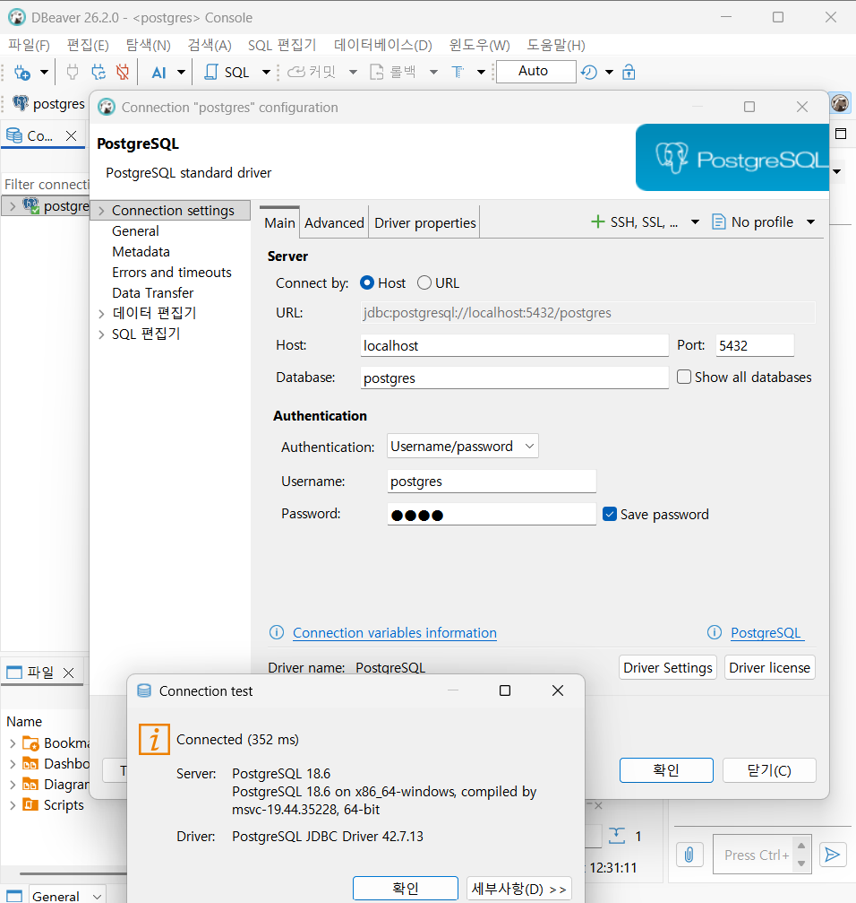
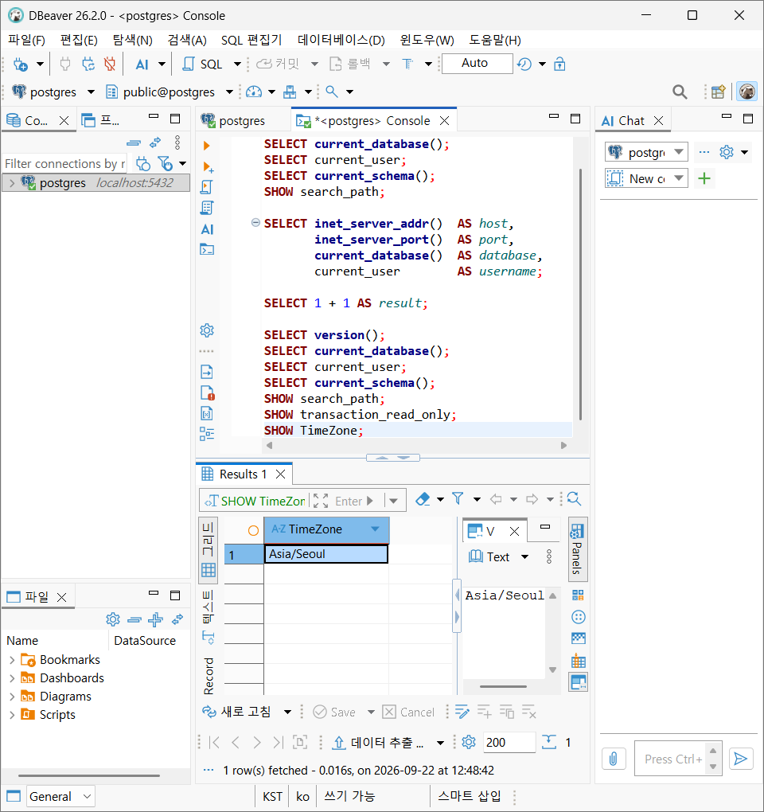
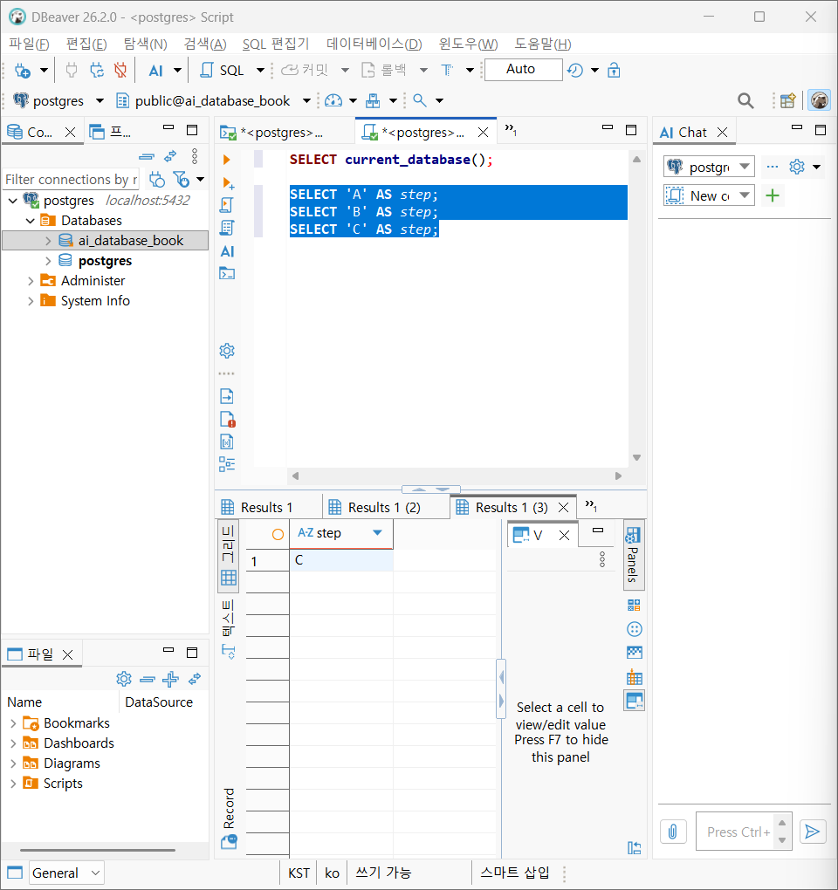

# Chapter 03 확장 실습 답안 템플릿

> **과제:** PostgreSQL과 DBeaver로 실습 환경 검증하기  
> **사용 방법:** 이 파일을 내려받아 본인의 GitHub 저장소에 `chapter03_answer.md`라는 이름으로 저장한 뒤 실습하면서 바로 작성합니다.  
> **제출 방법:** LMS에는 파일을 직접 업로드하지 않고, **본인 GitHub 저장소의 `chapter03_answer.md` 파일 URL**을 제출합니다.

---

## 제출 전 보안 주의

이 과제 파일과 캡처 화면에는 다음 정보를 올리지 않습니다.

```text
실제 PostgreSQL 비밀번호
전체 DB 접속 URL
API Key / Token
개인정보
공개할 필요가 없는 사내 서버 주소
```

LMS에서 제출자를 확인할 수 있으므로 공개 저장소의 답안 파일에 학번이나 실명을 반드시 적을 필요는 없습니다.

```text
GitHub 계정 또는 별칭: 유진
과제 작성일: 2026.09.22.
사용한 AI 도구: Chatgpt, claude
```

---

# 1. PostgreSQL과 DBeaver 환경 확인

## 1-1. 내 환경

| 항목 | 작성 내용 |
| --- | --- |
| 운영체제 | Windows 11 Home 25H2 (OS 빌드 26200.9457) |
| PostgreSQL 버전 | PostgreSQL 18.6 on x86_64-windows, compiled by msvc-19.44.35228, 64-bit |
| DBeaver 버전 | 버전26.2.0.202608301738 |
| Host | localhost |
| Port | 5432 |
| Database | postgres |
| Username | postgres |

> 비밀번호는 기록하지 않습니다.

## 1-2. PostgreSQL과 DBeaver 역할 설명

```text
PostgreSQL은:데이터를 저장하고 SQL을 실행하는 관계형 DBMS

DBeaver는: PostgreSQL에 연결해 SQL을 작성하고 결과를 보여 주는 클라이언트

두 프로그램의 차이는: PostgreSQL이라는 서버에 쉽게 SQL을 보내기 위한 클라이언트가 DBeaver이다.
```
---

# 2. 연결 테스트와 첫 SQL

## 2-1. DBeaver 연결 결과

- [ ] PostgreSQL 연결 유형 선택
- [ ] Host 확인
- [ ] Port 확인
- [ ] Database 확인
- [ ] Username 확인
- [ ] Test Connection 성공

### 연결 성공 화면

권장 이미지 경로:

```text
assignments/chapter03/images/step02_connection.png
```

`여기에 연결 성공 화면을 삽입하세요.`


## 2-2. 첫 SQL 실행

```sql
SELECT 1 + 1 AS result;
```

실행 전 예상:

```text
result라는 이름으로 2가 나올 것 같다.
```

실제 결과:

```text
2
```

이 결과가 의미하는 것:

```text
PostgreSQL 서버가 1+1을 계산해 2를 돌려주었으므로 DBeaver–PostgreSQL 연결과 SQL 실행이 정상이다.
SELECT는 테이블 없이도 식을 평가할 수 있고, AS로 결과 열 이름(result)을 지정할 수 있다.
```

---

# 3. 현재 연결 위치를 SQL로 검증

다음 SQL을 실행합니다.

```sql
SELECT version();
SELECT current_database();
SELECT current_user;
SELECT current_schema();
SHOW search_path;
SHOW transaction_read_only;
SHOW TimeZone;
```

## 3-1. 결과 기록

| 확인 항목 | 실제 결과 | 내가 이해한 의미 |
| --- | --- | --- |
| `version()` | PostgreSQL 18.6 on x86_64-windows, compiled by msvc-19.44.35228, 64-bit | 접속한 서버가 Windows 64비트용으로 빌드된 PostgreSQL 18.6이다. |
| `current_database()` | postgres | 현재 세션이 연결된 데이터베이스는 postgres이다. |
| `current_user` | postgres  | 현재 PostgreSQL 세션에서 사용되는 사용자 |
| `current_schema()` | public |  검색 경로에서 현재 사용할 수 있는 첫 번째 스키마 |
| `search_path` | public, "$user" | 스키마 이름 없이 테이블명만 쓸 때 스키마를 찾는 순서 |
| `transaction_read_only` | off | off이므로 현재 트랜잭션은 읽기·쓰기가 모두 가능하다. |
| `TimeZone` | Asia/Seoul | 세션 시간대가 한국 표준시(KST, UTC+9)이다. |

## 3-2. 반드시 설명할 것

### DBeaver 연결 이름과 `current_database()`는 왜 같은 개념이 아닌가요?

```text
연결 이름은 클라이언트 쪽 별명(label) 이고, current_database()는 서버 쪽에서 실제로 접속된 DB입니다.
```

### `current_schema()`와 `search_path`는 어떤 관계가 있나요?

```text
search_path는 스키마 탐색 순서를 담은 목록(설정값) 이고, current_schema()는 그 목록에서 실제로 존재하는 첫 번째 스키마를 돌려주는 함수입니다.
```

### `transaction_read_only = off`라는 결과만으로 모든 테이블을 만들 권한이 있다고 단정할 수 있나요?

```text
단정할 수 없습니다. transaction_read_only는 트랜잭션의 동작 모드이고, 테이블을 만들 수 있는지는 권한이 별도로 결정합니다.
```

## 3-3. 증거 화면

권장 경로:

```text
assignments/chapter03/images/step03_location_check.png
```

`여기에 현재 DB/사용자/스키마/search_path 결과 화면을 삽입하세요.`



---

# 4. `ai_database_book` 데이터베이스 확인

## 4-1. 현재 데이터베이스

```sql
SELECT current_database();
```

실제 결과:

```text
ai_database_book
```

- [O] 결과가 `ai_database_book`이다.
- [O] 다른 DB라면 올바른 연결로 전환했다.

## 4-2. 연결을 바꾼 뒤 다시 검증

```text
전환 전 데이터베이스: postgres
전환 후 데이터베이스: ai_database_book
전환 여부를 판단한 근거: 전환 전후에 SELECT current_database();를 실행한 결과가 postgres에서 ai_database_book으로 바뀌었다.
```

### 화면에서 보이는 연결 이름만 믿지 않고 SQL을 다시 실행해야 하는 이유

```text
화면의 연결 이름은 클라이언트(DBeaver)의 표시일 뿐이고, 실제로 어느 DB에 붙어 있는지는 서버만 정확히 답할 수 있기 때문이다.
```

---

# 5. SQL 실행 범위 실험

SQL Editor에 다음 세 문장을 입력합니다.

```sql
SELECT 'A' AS step;
SELECT 'B' AS step;
SELECT 'C' AS step;
```

## 5-1. 한 문장 실행

```text
내가 실행한 문장: 하나씩 실행했다.
실제 결과: 실행할 때 마다, STEP 결과 탭에 A,B,C가 차례로 출력되었다.
```

## 5-2. 선택 영역 실행

```text
선택한 문장: SELECT 'B' AS step; SELECT 'C' AS step;
실제 결과: 결과 탭 2개가 생겨 각각 B, C가 출력되었다.
```

## 5-3. 전체 스크립트 실행

```text
실제 결과: 세 문장이 모두 실행되어 결과 탭 3개가 생겼다.
결과 탭 또는 실행 순서에서 관찰한 점: 문장마다 결과 탭이 따로 생겼고, 탭 순서가 A→B→C로 편집기에 적힌 순서와 같았다.
```

## 5-4. 결과 해석

```text
한 문장 실행과 전체 스크립트 실행의 차이:
Ctrl+Enter는 커서가 있는 문장 하나만 실행해 결과가 1개 나온다. Alt+X는 선택 영역을 스크립트로 보고 문장들을 순서대로 모두 실행해 문장마다 결과가 나온다.
변경 SQL에서 실행 범위를 잘못 선택하면 위험한 이유:
UPDATE/DELETE/DROP 같은 변경 SQL은 실행 즉시 데이터를 바꾸기 때문에 위험하다.
```

### 증거 화면

권장 경로:

```text
assignments/chapter03/images/step05_execution_scope.png
```

`여기에 실행 범위 비교 화면을 삽입하세요.`

---

# 6. 제공된 환경 확인 SQL 실행

Public 저장소의 Chapter 03 파일을 사용합니다.

```text
code/chapter03/setup_check.sql
code/chapter03/setup_validate_local.sql
```

## 6-1. `setup_check.sql`

실행 결과에서 확인한 항목:

```text
PostgreSQL 버전: PostgreSQL 18.6 on x86_64-windows, compiled by msvc-19.44.35228, 64-bit
현재 DB: ai_database_book
현재 사용자: postgres
현재 스키마: public
search_path: public, "$user"
읽기 전용 여부: off
TimeZone: Asia/Seoul
1 + 1 결과: 2
public 스키마 존재 여부: true
public USAGE 권한: true
public CREATE 권한: true
```

### 이 파일을 여러 번 실행해도 비교적 안전한 이유

```text
파일의 모든 문장이 SELECT/SHOW 조회문뿐입니다.
```

## 6-2. `setup_validate_local.sql`

```text
실행 결과: 첫 SELECT에서 server_version_num=180006, database_name=ai_database_book, user_name=postgres, current_schema_name=public, transaction_read_only=off, timezone=Asia/Seoul, public 스키마 존재/USAGE/CREATE가 모두 true로 나왔다. 이어서 DO 블록이 오류 없이 끝났고, 출력 탭에 "Chapter 03 recommended local environment validation passed"가 표시되었다.
PASS / FAIL: PASS
```

실패했다면 실패 항목:

```text
PASS했음
```

그 실패가 실제 문제인지 환경 차이인지 판단한 근거:

```text
PASS했음
```

---

# 7. 안전한 오류 진단 실습

실제 오류가 있었다면 그 오류를 사용합니다. 오류가 없었다면 **데이터를 삭제하거나 서버를 강제로 중지하지 말고**, 안전한 SQL 문법 오류를 하나 만들어 관찰합니다.

예:

```sql
SELEC 1;
```

> 오류를 확인한 뒤 올바른 `SELECT 1;`로 복구합니다.

## 7-1. 오류 기록

```text
오류 메시지 핵심 문장: 구문 오류

내가 먼저 생각한 원인 1: SELECT 키워드의 철자가 틀렸다.

내가 먼저 생각한 원인 2: 편집기가 서버에 제대로 연결되지 않았다.

실제로 확인한 방법: SELEC을 SELECT로 고쳐 SELECT 1;로 다시 실행했다.

실제 원인: 첫 키워드 SELECT를 SELEC으로 잘못 입력한 SQL 문법 오류.

수정한 내용: SELEC을 SELECT로 고쳐 SELECT 1;로 다시 실행했다.
```

## 7-2. 수정 후 재검증

```sql
SELECT 1;
SELECT current_database();
```

```text
재검증 결과: SELECT 1;은 1을, SELECT current_database();는 ai_database_book을 반환했다. 문법 오류가 해결되었고, 의도한 DB에 연결되어 있음을 다시 확인했다.
```

## 7-3. 오류를 유형으로 분류

- [ ] 서버 실행 문제
- [ ] Host 문제
- [ ] Port 문제
- [ ] Database 문제
- [ ] Username/인증 문제
- [O] SQL 문법 문제
- [ ] 권한 문제
- [ ] 기타

선택 이유:

```text
구문오류라고 서버가 알려주었다.
```

---

# 8. AI를 오류 분석 보조 도구로 사용

## 8-1. AI에게 전달한 프롬프트

비밀번호·개인정보·전체 접속 URL은 제거하고 기록합니다.

```text
ai_database_book DB에서 SQL을 실행했는데 아래 오류가 났어.
실행한 SQL: SELEC 1;
오류: SQL Error [42601]: 오류: 구문 오류, "SELEC" 부근
  위치: 1
Error position: line: 113

원인 후보를 확인 방법과 함께 알려 줘. 확인 없이 원인을 단정하지 말아 줘.


```

## 8-2. AI 답변 검토

| AI가 제안한 확인 방법 | 실제로 확인했는가? | 결과 | 수용 / 수정 / 거절 |
| --- | --- | --- | --- |
|오류 위치("SELEC", 위치 1) 확인 후 SELECT 1;로 고쳐 재실행| 수용 |  |  |
|Ctrl + L로 113번 줄로 이동해 실행 문장 확인| 확인 | 수용 |  |
| SELECT current_database();로 연결·DB 확인 | 거절 | 1에서 이미 해결 |  |

### AI가 오류 원인을 너무 빨리 단정한 부분이 있었나요?

```text
이번 답변은 프롬프트에서 "단정하지 말라"고 요청한 대로 후보를 나열했습니다.
```

### 오류 메시지와 실제 환경 중 무엇을 확인해서 최종 판단했나요?

```text
실제 환경에서 직접 실행한 결과로 최종 판단했다. 
```

### AI 활용에서 가장 유용했던 점

```text
한 메시지 안의 두 위치 정보(서버의 위치: 1과 DBeaver의 line: 113)가 서로 다른 기준이라는 걸 구분했습니다. 또 원인마다 확인 방법을 짝지어 줘서 스스로 검증할 수 있었습니다.
```

### AI 답변을 그대로 실행하지 않고 확인해야 하는 이유

```text
AI는 내 화면·버전·연결 상태를 볼 수 없다.
```


---

# 9. Chapter 01~02 개인 서비스와 연결

앞에서 선택한 개인 서비스가 PostgreSQL을 사용한다고 가정합니다.

```text
서비스 이름: 영화 예매 관리 서비스

사용할 데이터베이스 이름 후보: movie_booking

사용할 스키마 이름 후보: cinema

앞으로 만들고 싶은 테이블 후보 3개:
1. movies
2. screenings
3. bookings
```

### 아직 SQL을 만들지 않고 이름과 역할만 정하는 이유

```text
지금은 앞 단계라서, 결정되지 않은 것을 SQL로 굳히면 나중에 고치는 비용이 커질 수 있습니다.
```

### Chapter 02에서 정리했던 한 행의 의미 중 수정할 부분이 있나요?

```text
bookings를 고객 한 명이 특정 상영 회차에 대해 진행한 예매(결제) 한 건.
screenings은 특정 영화가 특정 상영관에서 특정 시각에 상영되는 한 회차.

```

---

# 10. 초보자용 연결 가이드 작성

친구가 자신의 PC에서 같은 실습을 시작한다고 가정합니다. 아래 순서를 자신의 말로 작성합니다.

```text
1. PostgreSQL 서버가 실행되는지 확인하는 방법:
services.msc 실행해서 postgresql-x64-18이 실행중인지 확인한다.
2. DBeaver에서 PostgreSQL 연결을 만드는 방법:
새 연결에서 postgresql의 main탭에 정보를 입력하고 test connection을 누르면 완료돼.
3. Host / Port / Database / Username의 의미:
Host는 PostgreSQL 서버가 있는 컴퓨터 주소야. 내 PC면 localhost야. Port는 그 컴퓨터에서 PostgreSQL이 요청을 받는 번호고, 기본값은 5432야.
Database는 서버 안에 있는 여러 데이터베이스 중 어디에 접속할지를 정하는 거야. 데이터베이스 안에 스키마가 있고, 스키마 안에 테이블이 있어.
Username은 로그인할 때 쓰는 사용자 이름이고, 서버는 이 사용자를 기준으로 무엇을 할 수 있는지를 판단해.
4. ai_database_book에 연결되었는지 확인하는 방법:
SELECT current_database();로 확인해.
5. 현재 위치를 확인하는 SQL:
SELECT current_database(), current_user, current_schema();
SHOW search_path;
6. 한 문장과 전체 스크립트 실행을 구분해야 하는 이유:
Ctrl + Enter는 한 문장, Alt + X는 선택 영역 또는 전체를 실행하는건데 되돌릴 수 없는 것도 있으니 조심해.
7. 비밀번호를 GitHub나 AI 프롬프트에 넣으면 안 되는 이유:
기록에 남기 때문에 절대 넣으면 안돼.
```

---

# 11. 최종 성찰

아래 문장은 반드시 본인의 말로 작성합니다.

```text
1. DBeaver와 PostgreSQL의 가장 중요한 차이는
   ___클라이언트와 서버라는 점_________________________________________________________ 이다.

2. 내가 지금 어느 데이터베이스에 연결되어 있는지 확인할 때
   화면 이름만 보지 않고 __서버에서 출력되는 것을 확인____________________________________ 해야 한다.

3. PostgreSQL 오류가 발생했을 때 가장 먼저 해야 할 일은
   ____화면에서 뜬 오류 원인을 살펴보는 것________________________________________________________ 이다.

4. AI를 오류 해결에 사용할 때 가장 중요한 것은
   ___비판적으로 살펴보는 것_________________________________________________________ 이다.
```

---

# 12. 제출 체크리스트

- [O] `chapter03_answer.md`의 빈 필수 항목을 작성했다.
- [O] PostgreSQL과 DBeaver의 역할 차이를 설명했다.
- [O] `current_database/current_user/current_schema/search_path`를 실제로 확인했다.
- [O] `ai_database_book` 연결 여부를 SQL로 검증했다.
- [O] SQL 실행 범위 세 가지를 비교했다.
- [O] `setup_check.sql`을 실행했다.
- [O] `setup_validate_local.sql` 결과를 확인했다.
- [O] 오류 원인을 먼저 스스로 추정한 뒤 AI를 사용했다.
- [O] AI 제안을 실제 환경에서 검증했다.
- [O] 핵심 캡처 3~4장만 골라 넣었다.
- [O] 캡처에 비밀번호·개인정보·전체 접속 URL이 없다.
- [O] Markdown 이미지가 GitHub 웹 화면에서 실제로 보인다.
- [O] 최종 답안 파일을 commit/push했다.

---

# 13. LMS 제출 URL

아래 형식의 **본인 GitHub 파일 URL**을 LMS에 제출합니다.

```text
https://github.com/<본인-GitHub-ID>/<본인-저장소>/blob/main/assignments/chapter03/chapter03_answer.md
```

내 제출 URL:

```text

```

> 저장소 메인 URL, 교수자 템플릿 URL, Raw URL이 아니라 **작성 완료된 본인 `chapter03_answer.md` 파일 화면 URL**을 제출합니다.
