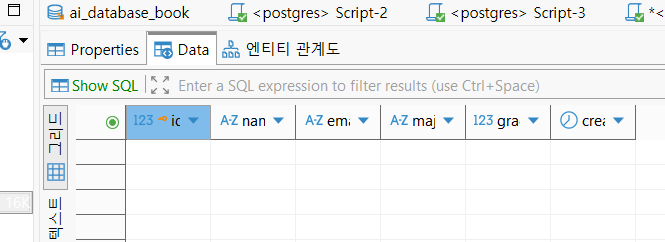
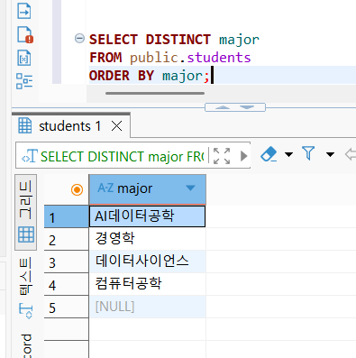
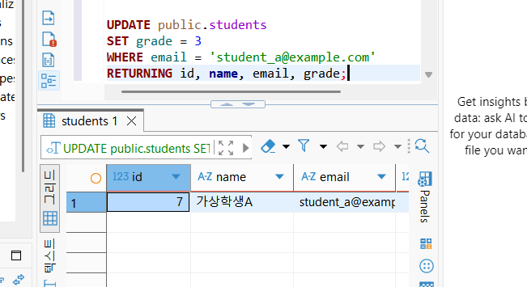
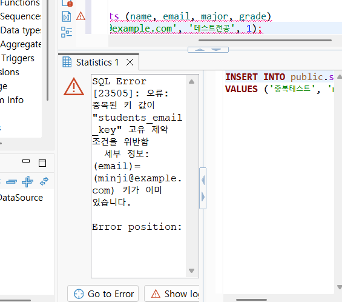

# Chapter 04 확장 실습 답안

> **과제:** 관계형 데이터베이스와 SQL 시작하기  
> **제출 방법:** LMS에는 본인 GitHub 저장소의 `chapter04_answer.md` 파일 URL을 제출합니다.

---

## 제출 전 주의

이 파일과 캡처 화면에는 실제 비밀번호, 전체 DB 접속 URL, API Key, 개인정보를 기록하지 않습니다.

```text
GitHub 계정 또는 별칭: 유진
과제 작성일: 2026.10.06.
사용한 AI 도구: Claude
```

---

# 1. 실습 환경과 시작 상태 확인

```sql
SELECT current_database();
SELECT current_user;
SELECT current_schema();
SHOW search_path;
SHOW transaction_read_only;
```

| 확인 항목 | 실제 결과 | 의미 |
| --- | --- | --- |
| current_database() | ai_database_book | 지금 내 연결이 붙어 있는 데이터베이스 이름이다. 이번 실습은 ai_database_book에서 해야 한다. |
| current_user | postgres | 지금 SQL을 실행하는 계정 이름이다. 이 계정 권한으로 테이블을 만들고 데이터를 바꾼다. |
| current_schema() | public | 테이블 이름 앞에 스키마를 안 붙이면 기본으로 찾아가는 스키마다. |
| search_path | public, "$user" | 스키마를 찾는 순서다. 내 경우는 public을 먼저 보고, 거기 없으면 내 계정 이름이랑 같은 스키마를 본다. |
| transaction_read_only | off | off면 데이터를 바꿀 수 있는 연결이고, on이면 조회만 된다. |

- [x] 현재 DB가 `ai_database_book`이다.
- [x] 변경 가능한 연결인지 확인했다.
- [x] 실행할 SQL 범위를 확인했다.
- [x] Auto-commit 상태를 확인했다.

### 변경 SQL을 실행하기 전에 현재 DB와 실행 범위를 확인해야 하는 이유

```text
DB를 잘못 고른 채로 실행하면 SQL은 문제없이 돌아가도 엉뚱한 DB에 테이블이 생기거나 데이터가 바뀐다.
그래서 데이터를 바꾸는 SQL 전에는 어디에, 어디까지 실행하는지부터 확인해야 한다.
```

---

# 2. `public.students` 구조 생성

## 2-1. 실행 전 예상

```text
테이블 이름: public.students (public 스키마 안의 students 테이블)
한 행의 의미: 학생 한 명
예상 행 수: 0
기본키: id
필수 열: id, name, email, created_at
중복을 막는 열: id, email
자동 생성 열: id (IDENTITY라서 번호가 자동으로 붙음), created_at (DEFAULT라서 넣은 시각이 자동으로 들어감)
```

## 2-2. 실행 파일

```text
code/chapter04/01_create_students.sql
```

## 2-3. 실행 후 확인

```text
테이블 생성 성공 여부: 성공
실제 행 수: 0
DBeaver에서 확인한 위치: ai_database_book > Schemas > public > Tables > students
```

### 각 열의 역할

| 열 | 타입 | NULL 가능? | 역할 |
| --- | --- | --- | --- |
| id | integer | 불가 (NO) | 학생 한 명 한 명을 DB 안에서 구분하는 번호(PK). 자동으로 매겨진다. |
| name | character varying | 불가 (NO) | 학생 이름. 꼭 있어야 하는 값이라 비워둘 수 없다. |
| email | character varying | 불가 (NO) | 학생 이메일. 겹치면 안 돼서 UPDATE·DELETE 때 학생 한 명을 딱 찾는 기준으로 쓴다. |
| major | character varying | 가능 (YES) | 전공. 아직 모를 수 있어서 비워둘 수 있다. |
| grade | integer | 가능 (YES) | 학년. 아직 모를 수 있어서 비워둘 수 있다. |
| created_at | timestamp with time zone | 불가 (NO) | 행이 들어간 시각. 안 넣으면 DB가 알아서 채운다. |

### `id`를 학번이나 학생 수로 해석하면 안 되는 이유

```text
id는 DB가 행끼리 안 겹치게 붙여 주는 번호일 뿐이다. 학생을 지워도 그 번호는 다시 안 채워지고, INSERT가 실패해도 번호가 하나 날아갈 수 있어서 중간중간 빈다. 그래서 제일 큰 id가 학생 수랑 같다는 보장이 없다.
학번은 학교가 정한 업무용 번호고, id는 DB 안에서만 쓰는 번호라서 성격이 다르다.
```

### 증거 화면



---

# 3. 샘플 데이터 6명 입력

## 3-1. 실행 전 예상

```text
현재 행 수: 0
실행 후 예상 행 수: 6
예상되는 NULL 포함 학생: 윤서진
```

## 3-2. 실행 파일

```text
code/chapter04/02_insert_students.sql
```

## 3-3. 실제 결과

```text
실제 행 수: 6
이준호 grade: 3
박서연 존재 여부: 있음
윤서진 major: NULL
윤서진 grade: NULL
```

### 예상과 실제 비교

```text
예상과 실제가 일치했는가: 일치
다르다면 이유: 없음. 예상대로 6명이 들어갔고, 윤서진만 major랑 grade가 NULL이었다.
```

### `created_at` 값이 여러 행에서 같을 수 있는 이유

```text
02 파일은 INSERT 여러 개를 BEGIN이랑 COMMIT으로 한 트랜잭션에 묶었다. PostgreSQL의 CURRENT_TIMESTAMP는 문장이 실행된 순간이 아니라 트랜잭션이 시작된 순간의 시각이라서, 같은 트랜잭션 안에서 들어간 행들은 created_at이 똑같이 찍힐 수 있다.
실제로도 6명 전부 created_at이 2026-10-06 20:03:08.818로 똑같이 찍혀 있었다.
```

---

# 4. SELECT 복습과 결과 검증

각 문제는 **SQL 실행 전에 예상 행 수를 먼저 작성**했습니다.

| 번호 | 조회 문제 | 예상 행 수 | 실제 행 수 | 일치? | 다르면 이유 |
| ---: | --- | ---: | ---: | --- | --- |
| 1 | 전체 학생 | 6 | 6 | O |  |
| 2 | 이름·이메일만 조회 | 6 | 6 | O |  |
| 3 | 특정 전공 (컴퓨터공학) | 2 | 2 | O |  |
| 4 | 특정 학년 이상 (3학년 이상) | 2 | 2 | O |  |
| 5 | 두 전공 중 하나 (`IN`) | 3 | 3 | O |  |
| 6 | `grade IS NULL` | 1 | 1 | O |  |
| 7 | 전공 `DISTINCT` | 5 | 5 | O |  |
| 8 | 정렬 후 상위 3명 (`ORDER BY + LIMIT`) | 3 | 3 | O |  |

실행한 SQL:

```sql
-- 1. 전체 학생
SELECT *
FROM public.students
ORDER BY id;

-- 2. 이름·이메일만 조회
SELECT name, email
FROM public.students
ORDER BY id;

-- 3. 특정 전공 (컴퓨터공학)
SELECT id, name, major
FROM public.students
WHERE major = '컴퓨터공학'
ORDER BY id;

-- 4. 특정 학년 이상 (3학년 이상)
SELECT id, name, grade
FROM public.students
WHERE grade >= 3
ORDER BY grade DESC, id;

-- 5. 두 전공 중 하나 (IN)
SELECT id, name, major
FROM public.students
WHERE major IN ('컴퓨터공학', '데이터사이언스')
ORDER BY id;

-- 6. grade IS NULL
SELECT id, name, grade
FROM public.students
WHERE grade IS NULL;

-- 7. 전공 DISTINCT
SELECT DISTINCT major
FROM public.students
ORDER BY major;

-- 8. 정렬 후 상위 3명 (ORDER BY + LIMIT)
SELECT id, name, grade
FROM public.students
ORDER BY grade DESC, id
LIMIT 3;
```

## 4-1. 내가 직접 작성한 SQL 2개

```sql
-- SQL 1
SELECT id, name, major
FROM public.students
WHERE major <> '경영학'
ORDER BY id;
```

```text
질문: 전공이 경영학이 아닌 학생은 몇 명일까?
이 SQL의 한 행 의미: 전공이 경영학이 아닌 학생 한 명
예상 행 수: 4
실제 행 수: 4
결과 해석: 예상대로 4명이 나왔다. 경영학인 박서연이 빠지는 건 당연한데, major가 NULL인 윤서진도 같이 빠졌다. NULL은 '경영학이 아니다'를 물어도 참이 아니라 UNKNOWN이 돼서 WHERE에서 걸러진다. 윤서진까지 보려면 OR major IS NULL을 따로 붙여야 한다.
```

```sql
-- SQL 2
SELECT id, name, major, grade
FROM public.students
WHERE major = '컴퓨터공학'
  AND grade >= 3
ORDER BY id;
```

```text
질문: 컴퓨터공학 전공이면서 3학년 이상인 학생은 누구일까?
이 SQL의 한 행 의미: 두 조건을 다 만족하는 학생 1명
예상 행 수: 1
실제 행 수: 1
결과 해석: 예상대로 1명이 나왔다. 컴퓨터공학은 김민지(2학년)랑 최현우(4학년) 두 명인데, AND라서 3학년 이상 조건까지 같이 만족하는 최현우만 남았다.
```

## 4-2. `= NULL` 대신 `IS NULL`을 사용하는 이유

```text
NULL은 값이 0이라는 게 아니라 아예 모른다는 뜻이다. 그래서 grade = NULL은 '모르는 값이랑 모르는 값이 같냐'를 묻는 셈이라 참도 거짓도 아닌 UNKNOWN이 된다.
WHERE는 참인 행만 남기니까 = NULL로 쓰면 grade가 비어 있는 윤서진도 안 나오고 0행이 된다. 비어 있는 걸 찾으려면 IS NULL로 '값이 없냐'를 물어야 한다.
실제로 해 보니 WHERE grade = NULL은 0행, WHERE grade IS NULL은 1행(윤서진)이 나왔다.
```

## 4-3. `ORDER BY` 없이 결과 순서를 믿으면 안 되는 이유

```text
테이블은 줄 서 있는 목록이 아니라 순서 없는 행 모음이다. 지금은 넣은 순서대로 보이는 것 같아도 수정이나 삭제를 하고 나면 순서가 바뀔 수 있다. DB가 순서를 약속해 주는 건 ORDER BY로 정렬하라고 시켰을 때뿐이라서, 순서가 중요하면 꼭 ORDER BY를 써야 한다.
```

## 4-4. `DISTINCT`가 원본 데이터를 삭제하는 기능인가요?

```text
아니다. DISTINCT는 조회 결과에서 똑같은 줄을 하나로 합쳐서 보여주는 거지, 테이블에 있는 데이터를 지우는 게 아니다. SELECT는 보여주기만 하니까 원본 행 수는 그대로다.
```

### 증거 화면



---

# 5. 내 가상 학생 2명 추가

> 실행 순서: 8번(`04_update_delete_students.sql`)을 먼저 실행한 뒤 이 섹션을 진행했습니다.

## 5-1. 실행 전 계획

```text
학생 A
이름: 가상학생A
이메일: student_a@example.com
전공: 데이터과학
학년: 2

학생 B
이름: 가상학생B
이메일: student_b@example.com
전공: 인공지능
학년 또는 NULL: NULL

현재 행 수: 5
추가 후 예상 행 수: 7
```

## 5-2. 내가 실행한 INSERT

```sql
-- 실행 전 행 수
SELECT COUNT(*) FROM public.students;

INSERT INTO public.students (name, email, major, grade)
VALUES
    ('가상학생A', 'student_a@example.com', '데이터과학', 2),
    ('가상학생B', 'student_b@example.com', '인공지능', NULL)
RETURNING id, name, email, major, grade;

-- 실행 후 행 수
SELECT COUNT(*) FROM public.students;
```

## 5-3. 실제 결과

```text
RETURNING 또는 확인 SELECT 결과: 
  2행.
  7 | 가상학생A | student_a@example.com
  8 | 가상학생B | student_b@example.com
  박서연이 쓰던 3번은 다시 안 쓰이고, 6 다음 번호인 7, 8이 붙었다.
실제 전체 행 수: 7
예상과 일치 여부: 일치
```

### 내가 일부 값을 NULL로 둔 이유 또는 NULL을 사용하지 않은 이유

```text
학생 B는 학년을 아직 모르는 상황(배정 전)이라고 보고 NULL로 뒀다. 0을 넣으면 '0학년'이라는 틀린 정보가 되니까, 모르는 건 모른다고 비워두는 게 맞다.
```

---

# 6. 안전한 UPDATE

## 6-1. 먼저 대상 확인 SELECT

```sql
SELECT *
FROM public.students
WHERE email = 'student_a@example.com';
```

```text
예상 대상 행 수: 1
실제 대상 행 수: 1
```

## 6-2. UPDATE

```sql
UPDATE public.students
SET grade = 3
WHERE email = 'student_a@example.com'
RETURNING id, name, email, grade;
```

```text
예상 영향 행 수: 1
실제 영향 행 수: 1
RETURNING 결과: 
  1행이 반환됐다.
  7 | 가상학생A | student_a@example.com | grade 3
```

## 6-3. UPDATE 후 재조회

```sql
SELECT *
FROM public.students
WHERE email = 'student_a@example.com';
```

```text
재조회 결과 grade: 3
예상과 일치 여부: 일치
```

### `WHERE` 없는 UPDATE를 실행하면 위험한 이유

```text
WHERE가 없으면 조건 없이 테이블 전체 행이 다 바뀐다. 학생 A 한 명만 3학년으로 바꾸려다가 모든 학생 학년이 3이 돼버린다.
```

### 증거 화면



---

# 7. 안전한 DELETE

## 7-1. 삭제 전 확인

```sql
SELECT *
FROM public.students
WHERE email = 'student_b@example.com';
```

```text
예상 대상 행 수: 1
실제 대상 행 수: 1
```

## 7-2. DELETE

```sql
DELETE FROM public.students
WHERE email = 'student_b@example.com'
RETURNING id, name, email;
```

```text
예상 영향 행 수: 1
실제 영향 행 수: 1
RETURNING 결과: 8 | 가상학생B | student_b@example.com
```

## 7-3. 삭제 후 재조회

```sql
SELECT *
FROM public.students
WHERE email = 'student_b@example.com';

SELECT COUNT(*) FROM public.students;
```

```text
삭제 후 같은 조건의 SELECT 결과 행 수: 0
삭제 후 전체 행 수: 6
```

### `DELETE` 성공 메시지만 보고 끝내지 않고 다시 SELECT해야 하는 이유

```text
DELETE는 지운 행이 0개여도 오류 없이 성공으로 끝난다. 이메일을 오타 내서 아무것도 안 지워져도 성공 메시지는 똑같이 뜬다. 반대로 조건을 잘못 걸어서 생각보다 많이 지워졌을 수도 있다.
그래서 메시지만 믿지 말고 같은 조건으로 다시 SELECT해서 0행인지, 전체 행 수가 하나만 줄었는지 직접 봐야 한다.
```

---

# 8. 본문 기준 UPDATE·DELETE 상태 검증

`04_update_delete_students.sql`을 본문 시작 상태(샘플 6명)에서 실행했습니다. 실행 시점은 4번 SELECT 실습 직후, 5번 가상 학생 추가 전입니다.

```text
최종 학생 수: 5
이준호 grade: 4
박서연 존재 여부: 없음 (0행)
```

본문 기준 기대 상태와 비교합니다.

```text
학생 수 = 5
이준호 grade = 4
박서연 = 0행
```

### 내 실제 결과가 기준과 다르다면 원인

```text
기준과 일치함. 이 파일은 가상 학생 추가 전에 실행했다.
실행 중에 SQL Error [25P02](현재 트랜잭션은 중지되어 있다)가 떴는데, ROLLBACK 하고 다시 확인해 보니 학생 5명, 이준호 grade 4, 박서연 0행이라 04 파일 결과는 제대로 반영돼 있었다.
```

---

# 9. 의도한 실패 2개 관찰

> 실패 테스트는 데이터베이스 규칙이 실제로 데이터를 보호하는지 확인하는 실험입니다.

## 9-1. 중복 이메일 `UNIQUE` 오류

내가 사용한 SQL:

```sql
INSERT INTO public.students (name, email, major, grade)
VALUES ('중복테스트', 'minji@example.com', '테스트전공', 1);
```

```text
오류 메시지 핵심 단서: 
  SQL Error [23505]: 오류: 중복된 키 값이 "students_email_key" 고유 제약 조건을 위반함
  세부 정보: (email)=(minji@example.com) 키가 이미 있습니다.
왜 실패해야 맞는가: email은 학생 한 명을 딱 찾는 기준인데 같은 이메일이 두 개가 되면 그게 깨진다. 그러면 email로 거는 UPDATE나 DELETE가 두 명한테 같이 먹힐 수 있다. 그래서 이미 있는 이메일을 또 넣으려고 하면 실패하는 게 맞다.
어떤 규칙이 작동했는가: email 열의 UNIQUE 제약조건 (students_email_key). CREATE TABLE의 email VARCHAR(100) UNIQUE NOT NULL 부분이다.
실패 후 기존 데이터가 어떻게 유지되었는가: 실패 전에도 6명, 실패 후에도 6명 그대로였다. 중복 이메일 행은 하나도 안 들어갔다.
```

## 9-2. 이름 `NULL` 입력 `NOT NULL` 오류

내가 사용한 SQL:

```sql
INSERT INTO public.students (name, email, major, grade)
VALUES (NULL, 'null_name_test@example.com', '테스트전공', 1);
```

```text
오류 메시지 핵심 단서: SQL Error [23502]: 오류: "name" 칼럼(해당 릴레이션 "students")의 null 값이 not null 제약조건을 위반했습니다.
왜 실패해야 맞는가: 학생 이름은 꼭 있어야 하는 값이라 name에 NOT NULL을 걸어 뒀다.
어떤 규칙이 작동했는가: name 열의 NOT NULL 제약조건
```

### 실패한 INSERT 뒤 자동 생성 `id` 번호에 빈 구간이 생길 수 있어도 문제라고 단정할 수 없는 이유

```text
id(IDENTITY)는 번호를 빨리, 안 겹치게 내주는 게 목적이라 INSERT가 실패해도 이미 꺼낸 번호를 되돌리지 않는다. NOT NULL 오류 메시지의 Failing row 첫 숫자가 바로 그렇게 버려진 번호다.
id는 행을 구분하는 용도라 번호가 이어지는지, 몇 개인지는 원래 의미가 없다. 그래서 빈 구간이 있어도 문제라고 볼 수 없다.
```

### 증거 화면



---

# 10. `verify_students.sql`로 최종 상태 확인

실행 파일:

```text
code/chapter04/verify_students.sql
```

```text
현재 전체 학생 수: 6
major NULL 개수: 1
grade NULL 개수: 1
이준호 grade: 4
박서연 존재 여부: f (없음)
현재 데이터 상태에서 예상과 다른 부분: 없음
```

### 검증 SQL을 따로 두면 좋은 이유

```text
SQL이 성공했다고 최종 데이터가 맞는 건 아니다. verify 파일은 데이터를 안 바꾸고 조회만 해서 몇 번이고 다시 돌려도 안전하고, 학생 수나 NULL 개수, 이준호 학년처럼 꼭 봐야 할 상태를 한 번에 확인할 수 있다. 작업 끝날 때마다 같은 기준으로 확인할 수 있어서 좋다.
```

---

# 11. AI를 SQL 작성자가 아니라 검토자로 활용

## 11-1. 내가 작성한 SQL

```sql
UPDATE public.students
SET grade = 3
WHERE email = 'student_a@example.com'
RETURNING id, name, email, grade;
```

## 11-2. AI에게 전달한 핵심 요청

```text
아래 SQL의 안전성을 검토해 주세요.

1. 예상 영향 행 수
2. WHERE 조건이 충분히 구체적인지
3. 실행 전 확인할 SELECT
4. 실행 후 확인할 SELECT
5. 잘못 실행했을 때의 위험

참고: PostgreSQL, public.students 테이블, email 열은 UNIQUE NOT NULL입니다.

[내 SQL]
UPDATE public.students
SET grade = 3
WHERE email = 'student_a@example.com'
RETURNING id, name, email, grade;
```

## 11-3. AI 검토 결과

| AI 제안 | 수용 / 수정 / 거절 | 실제 검증 결과 | 나의 이유 |
| --- | --- | --- | --- |
| email이 UNIQUE라서 영향 행 수는 최대 1행이다. 학생 A가 있으면 1행. | 수용 | 실행 전 SELECT 1행, UPDATE RETURNING 1행 | 실제로 딱 1행만 바뀌어서 AI 예상이 맞았다. |
| 실행 전후에 같은 WHERE로 SELECT해서 바뀐 값을 확인하라. | 수용 | 전에는 grade 2, 후에는 grade 3. 최종 검증에서도 가상학생A는 3학년이었다. | 성공 메시지만으로는 진짜 바뀌었는지 모르니까 다시 봐야 한다. |
| WHERE에 AND grade = 2를 더 붙이면 실수로 두 번 실행해도 안전하다. | 거절 | WHERE email 조건만으로도 1행만 걸렸다. | 이번 목적은 grade를 3으로 만드는 거라 두 번 실행돼도 결과가 같다. 조건을 늘리면 오히려 헷갈려서 email 조건만 썼다. |

### AI가 예상한 영향 행 수와 실제 결과가 같았나요?

```text
같았다. AI는 1행을 예상했고, 실제로도 UPDATE 결과(RETURNING)가 1행이었다.
```

### AI 답변을 실행 전에 검토해야 하는 이유

```text
AI는 내 DB 안에 실제로 어떤 데이터가 있는지 못 본다. 그래서 영향 행 수도 추측일 뿐이고, 대상이 진짜 몇 행인지는 내가 같은 WHERE로 SELECT해 봐야 안다. 그럴듯해 보여도 그대로 실행하면 엉뚱한 행이 바뀔 수 있으니까 실행 전에 내가 확인해야 한다.
```

---

# 12. 내 서비스 테이블 하나 확장 설계

```text
서비스 이름: 영화 예매 관리 서비스
테이블 이름: bookings (예매)
한 행의 의미: 고객 한 명이 특정 상영 회차에 대해 진행한 예매(결제) 한 건
```

| 열 이름 | 저장할 값 | 타입 후보 | NULL 가능? | UNIQUE 후보? | 이유 |
| --- | --- | --- | --- | --- | --- |
| id | 예매 내부 번호 | INTEGER (IDENTITY) | 불가 | 예 | DB 안에서 예매 한 건을 구분하는 PK |
| booking_code | 예매번호 (고객한테 보여주는 번호) | VARCHAR(20) | 불가 | 예 | 고객이 예매 확인·취소할 때 쓰는 번호라 겹치면 안 된다 |
| screening_id | 어느 상영 회차인지 | INTEGER | 불가 | 아니오 | 한 회차에 예매가 여러 건이라 겹쳐도 된다. screenings 연결(FK)은 다음 장에서 정한다 |
| seat_no | 좌석 번호 (예: F12) | VARCHAR(10) | 불가 | 아니오 | 회차가 다르면 같은 좌석 번호가 또 나와서 혼자서는 UNIQUE가 아니다 |
| booked_at | 예매한 시각 | TIMESTAMPTZ | 불가 | 아니오 | 언제 예매했는지 남긴다. 안 넣으면 자동으로 지금 시각 |

```text
PK 후보: id
업무 식별자 후보: booking_code (예매번호)
아직 미확정인 규칙: 
  1. 같은 회차에 같은 좌석이 두 번 예매되지 않게 하는 규칙 (screening_id + seat_no 조합을 UNIQUE로 할지)
  2. 예매 취소를 행 삭제로 할지, 상태만 바꿀지
  3. 고객 정보를 어떻게 연결할지
```

## 선택: CREATE TABLE 초안

> 아직 확정되지 않은 업무 규칙은 억지로 제약조건으로 만들지 않습니다.

```sql
CREATE TABLE cinema.bookings (
    id INTEGER GENERATED BY DEFAULT AS IDENTITY PRIMARY KEY,
    booking_code VARCHAR(20) UNIQUE NOT NULL,
    screening_id INTEGER NOT NULL,
    seat_no VARCHAR(10) NOT NULL,
    booked_at TIMESTAMPTZ NOT NULL DEFAULT CURRENT_TIMESTAMP
);
-- 같은 회차 같은 좌석 중복 방지는 아직 미확정이라 안 넣었다.
```

---

# 13. 최종 성찰

```text
1. SQL 실행 성공과 올바른 대상 선택이 다른 이유는
   문법만 맞으면 SQL은 실행되지만, WHERE 조건을 잘못 걸어도 DB는 그냥 시킨 대로 다른 행을 바꾸거나 지워버리기 때문이다.

2. UPDATE와 DELETE 전에 SELECT를 먼저 해야 하는 이유는
   실행 전에 같은 WHERE로 어떤 행이 몇 개 걸리는지 눈으로 봐야, 엉뚱한 행이 바뀌거나 지워지는 걸 미리 막을 수 있기 때문이다.

3. 영향받은 행 수를 확인해야 하는 이유는
   UPDATE 1, DELETE 1처럼 실제로 몇 행이 바뀌었는지를 봐야 내가 의도한 만큼만 바뀌었는지 알 수 있고, 0행이어도 성공으로 끝나기 때문이다.

4. UNIQUE 또는 NOT NULL 오류를 '보호 장치가 정상 동작한 결과'라고 볼 수 있는 이유는
   SQL이 틀려서 실패한 게 아니라, 중복 이메일이나 이름 없는 학생 같은 잘못된 데이터가 못 들어오게 DB가 막아 준 것이고 기존 데이터도 그대로 남아 있기 때문이다.

5. AI가 SQL을 만들어 주더라도 내가 반드시 확인해야 하는 것은
   그 SQL이 실제 내 DB에서 어떤 행을 몇 개 건드리는지, 그리고 실행하고 나서 데이터가 진짜 원하는 상태가 됐는지 여부이다.
```

---

# 14. 제출 체크리스트

- [x] `chapter04_answer.md`를 본인 저장소에 만들었다.
- [x] 현재 DB와 실행 환경을 확인했다.
- [x] `public.students`를 생성했다.
- [x] 샘플 6명 입력 결과를 검증했다.
- [x] SELECT 문제에서 실행 전 예상 행 수를 작성했다.
- [x] 직접 만든 SELECT 2개를 실행했다.
- [x] 가상 학생 2명을 추가했다.
- [x] UPDATE 전후를 SELECT로 확인했다.
- [x] DELETE 전후를 SELECT로 확인했다.
- [x] UNIQUE 오류를 관찰했다.
- [x] NOT NULL 오류를 관찰했다.
- [x] `verify_students.sql`로 상태를 확인했다.
- [x] AI 제안을 실제 SQL 결과와 비교했다.
- [x] 개인 서비스 테이블 하나를 확장 설계했다.
- [x] 핵심 캡처는 3~4장 정도로 제한했다.
- [x] 비밀번호·개인정보가 캡처에 없다.
- [x] Markdown 이미지가 GitHub 웹 화면에서 정상 표시된다.
- [x] commit/push를 완료했다.

---

# 15. LMS 제출 URL

내 제출 URL:

```text
https://github.com/dhdbwls777/database-course-2026-2/blob/main/assignments/chapter04/chapter04_answer.md
```
